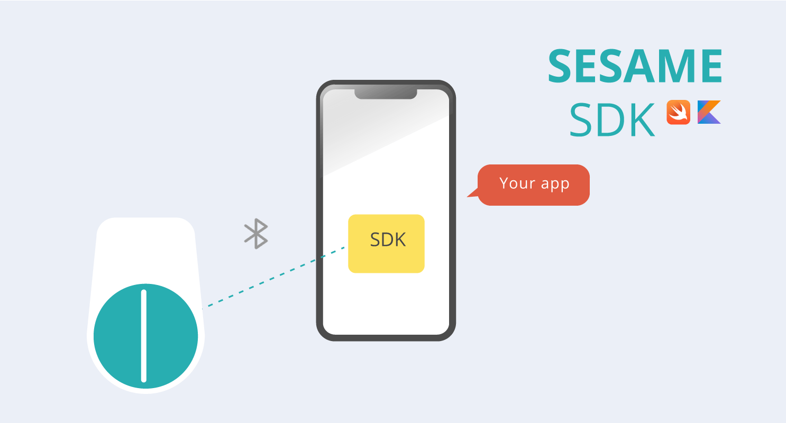

# SesameSDK3.0 for Android           	          [日本語はこちら](README_ja.md)
## [CANDY HOUSE 官方网站](https://jp.candyhouse.co/)

##### Google Play Apk [下载地址](https://play.google.com/store/apps/details?id=co.candyhouse.sesame2)

## 项目概述
#### SesameSDK 是一个简单、强大且免费的蓝牙/物联网（物联网）库，适用于 Android 应用程序。Sesame官方应用程序也是使用这个 SesameSDK 构建的，芝麻应用程序的所有功能都可以通过这个 SesameSDK 实现。SesameSDK 允许您：

- 注册 Sesame 设备（Sesame 5、Sesame 5 pro、Sesame Bike2、BLE Connector1、Open Sensor1、Sesame Touch 1 Pro、 Sesame Touch 1 、Sesame Bot1、WIFI Module2、Sesame 4、Sesame 3、Sesame Bike1、）
- 锁定和解锁

- 获取历史记录
- 更新 SesameOS3
- SesameOS3设备的各种设置
- 获取电池电量
#### 本项目SesameOs3主要解决硬件设备Sesame 5、Sesame 5 pro、Sesame Bike2、Sesame BLE Connector1、Sesame open sensor、Sesame Touch 1 Pro、 Sesame Touch 1 、WIFI Module2等产品通过蓝牙连接。帮助用户通过安卓移动应用软件智能操作硬件。如果你的产品是Sesame Bot 1、Sesame 3、Sesame 4、Sesame Bike 1请下载[SesameSDK_Android_with_DemoApp](https://github.com/CANDY-HOUSE/SesameSDK_Android_with_DemoApp)

##  技术栈和工具
- [编程语言 Kotlin](https://kotlinlang.org/)
- [android studio](https://developer.android.com/studio)  
   
### 1. 项目依赖
```svg

   implementation project(':sesame-sdk')
```
### 2. manifest.xml 注册权限
```agsl
   
    <uses-permission android:name="android.permission.BLUETOOTH" />
    <uses-permission android:name="android.permission.BLUETOOTH_ADMIN" />
    <uses-permission android:name="android.permission.BLUETOOTH_CONNECT" />
    <uses-permission android:name="android.permission.INTERNET"/>
    <uses-permission android:name="android.permission.ACCESS_NETWORK_STATE"/>
    <uses-permission android:name="android.permission.BLUETOOTH_CONNECT " />
    <uses-permission android:name="android.permission.ACCESS_FINE_LOCATION" />
    <uses-permission android:name="android.permission.BLUETOOTH_SCAN" />
```
### 3. application 初始化
```agsl
   override fun onCreate() {
        super.onCreate()
           CHBleManager(this)
        }
```
CHBleManager初始化会判断设备蓝牙是否正常、权限开启、蓝牙是否启动。一切正常开启蓝牙扫描
蓝牙ServiceUuid:0000FD81-0000-1000-8000-00805f9b34fb
```agsl
 bluetoothAdapter.bluetoothLeScanner.startScan(
 mutableListOf(ScanFilter.Builder().setServiceUuid(ParcelUuid(UUID.fromString("0000FD81-0000-1000-8000-00805f9b34fb"))).build()), ScanSettings.Builder().setScanMode(ScanSettings.SCAN_MODE_LOW_LATENCY).build(), bleScanner)

```
bleScanner 会将扫描到设备放入chDeviceMap 中

### 4. 添加新设备在ScanNewDeviceFG对象中,Adapter会拿到chDeviceMap过滤 (it.rssi!=null) 集合数据显示于列表中
```svg
    private var mDeviceList = ArrayList<CHDevices>()
 CHBleManager.delegate = object : CHBleManagerDelegate {
            override fun didDiscoverUnRegisteredCHDevices(devices: List<CHDevices>) {

          //     L.d("devices size",devices.size.toString())
                mDeviceList.clear()
                mDeviceList.addAll(devices.filter { it.rssi != null }
//                    .filter { it.rssi!! > -65 }///註冊列表只顯示距離近的
                )
                mDeviceList.sortBy { it.getDistance() }
                mDeviceList.firstOrNull()?.connect { }
                leaderboard_list.post((leaderboard_list.adapter as GenericAdapter<*>)::notifyDataSetChanged)
            }
        }
    }
```
### 5. 准备连接设备device 执行conect，onBleDeviceStatusChanged 监听device状态
```agsl
            device.connect { }
            doRegisterDevice(device)
            device.delegate = object : CHDeviceStatusDelegate {
                override fun onBleDeviceStatusChanged(device: CHDevices, status: CHDeviceStatus, shadowStatus: CHDeviceStatus?) {
                    if (status == CHDeviceStatus.ReadyToRegister) {
                      doRegisterDevice(device)
                       
                    }
                }
            }
            
           
   fun  doRegisterDevice(device: CHDevices){
       device.register {
       it.onSuccess {
           //  注册成功
       }
       it.onFailure {
          //  注册失败
           }
       }
   }
```
### 6. device.register回调注册成功失败指令，判断device 归属产品 model
```svg
                    (device as? CHWifiModule2)?.let {
                     
                    }
                    (device as? CHSesame2)?.let {
                     
                    }
                    (device as? CHSesame5)?.let {
                    
                    }
                    (device as? CHSesameTouchPro)?.let {
                       
                    }

```
- [Sesame 5](doc/command/sesame5fun.md):该实例对象应用于Sesame5 、Sesame5 pro 产品
- [Sesame Bike 2](doc/command/sesamebike2fun.md) : 该实例对象应用于 Sesame Bike 2 产品
- [Sesame WiFi Module 2](doc/command/sesamewifimodule.md):该实例对象应用于 Sesame WiFi Module 2 产品
- [Sesame touch pro](doc/command/sesametouchpro.md):该实例对象应用于 Sesame BLE Connector1、 Sesame Touch 1 Pro 、  Sesame Touch 1 产品
- [Sesame Open Sensor 1](doc/command/sesame_open_sensor.md):该实例对象应用于  Sesame Open Sensor 1 产品
- [Class对象](doc/class/allclass.md)
### 循环图


### [项目结构](./doc/product_structure.md)
### [项目框架](./doc/Sesame_framework.md)
### [项目界面](./doc/APP_instroduce.md)
###  [其他关联讲解](./doc/sesame_code.md)
### [SDK使用条款](https://jp.candyhouse.co/pages/sesamesdk%E5%88%A9%E7%94%A8%E8%A6%8F%E7%B4%84)
 ### android相关知识
- [Android Ble](https://developer.android.com/guide/topics/connectivity/bluetooth-le?hl=zh-cn)
- [Android Nfc](https://developer.android.com/guide/topics/connectivity/nfc?hl=zh-cn)
- [Android jetpack](https://developer.android.com/jetpack?hl=zh-cn)


