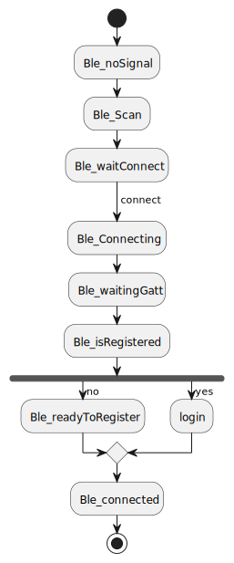

# SesameSDK3.0 for Android

- Sesame app on  [https://play.google.com/store/apps/details?id=co.candyhouse.sesame2](https://play.google.com/store/apps/details?id=co.candyhouse.sesame2)
- Sesame app on  [https://drive.google.com/file/d/15aRQl6aWBVwJSE4l3ZL-eMisPoe-f2lW/](https://drive.google.com/file/d/15aRQl6aWBVwJSE4l3ZL-eMisPoe-f2lW/)
- [CANDY HOUSE 公式サイト](https://jp.candyhouse.co/)


## 概要
#### SesameSDKは、Androidアプリケーション向けの無料で、シンプル且つパワフルなBluetooth/ AIoTライブラリです。Sesameの公式アプリケーションもこのSesameSDKを使用してすべての機能を構築し実現しております。SesameSDKでできること：

- Sesameデバイスの登録（Sesame 5、Sesame 5 pro、Sesame Bike2、BLE Connector1、Open Sensor1、Sesame Touch 1 Pro、 Sesame Touch 1 、Sesame Bot1、WIFI Module2、Sesame 4、Sesame 3、Sesame Bike1、）
- 施錠、解除、作動させるなど
- 履歴記録の取得
- SesameOS3のアップデート
- デバイスの各種設定
- バッテリー残量の取得

##  Requirements
.  
  
  
  

 
### 1. ライブラリーの依存
```svg
   implementation project(':sesame-sdk')
```
### 2. manifest.xml でAndroid権限を設定しましょう
```agsl
   
    <uses-permission android:name="android.permission.BLUETOOTH" />
    <uses-permission android:name="android.permission.BLUETOOTH_ADMIN" />
    <uses-permission android:name="android.permission.BLUETOOTH_CONNECT" />
    <uses-permission android:name="android.permission.INTERNET"/>
    <uses-permission android:name="android.permission.ACCESS_NETWORK_STATE"/>
    <uses-permission android:name="android.permission.BLUETOOTH_CONNECT " />
    <uses-permission android:name="android.permission.ACCESS_FINE_LOCATION" />
    <uses-permission android:name="android.permission.BLUETOOTH_SCAN" />
```
### 3. application 初期化
```agsl
   override fun onCreate() {
        super.onCreate()
           CHBleManager(this)
        }
```
CHBleManagerの初期化は、端末のBluetoothが正常に動作しているか、端末から権限をもらっているか、Bluetoothが起動しているかを判断します。すべてが正常に動作している場合、Bluetoothスキャンが始まります。
Bluetooth Service Uuid:0000FD81-0000-1000-8000-00805f9b34fb
```agsl
 bluetoothAdapter.bluetoothLeScanner.startScan(
 mutableListOf(ScanFilter.Builder().setServiceUuid(ParcelUuid(UUID.fromString("0000FD81-0000-1000-8000-00805f9b34fb"))).build()), ScanSettings.Builder().setScanMode(ScanSettings.SCAN_MODE_LOW_LATENCY).build(), bleScanner)

```
bleScannerがスキャンしたデバイスをCHDeviceMapに入れる。

### 4. 新規デバイスはScanNewDeviceFGオブジェクトに追加され、AdapterはCHDeviceMapからフィルタリングされた(it.rssi!=null)データをリストで表示します。
```svg
    private var mDeviceList = ArrayList<CHDevices>()
 CHBleManager.delegate = object : CHBleManagerDelegate {
            override fun didDiscoverUnRegisteredCHDevices(devices: List<CHDevices>) {

          //     L.d("devices size",devices.size.toString())
                mDeviceList.clear()
                mDeviceList.addAll(devices.filter { it.rssi != null }
//                    .filter { it.rssi!! > -65 }///註冊列表只顯示距離近的
                )
                mDeviceList.sortBy { it.getDistance() }
                mDeviceList.firstOrNull()?.connect { }
                leaderboard_list.post((leaderboard_list.adapter as GenericAdapter<*>)::notifyDataSetChanged)
            }
        }
    }
```
### 5. デバイスとの接続手順は、connectを実行し、onBleDeviceStatusChangedでデバイスの状態を監視すること。
```agsl
            device.connect { }
            doRegisterDevice(device)
            device.delegate = object : CHDeviceStatusDelegate {
                override fun onBleDeviceStatusChanged(device: CHDevices, status: CHDeviceStatus, shadowStatus: CHDeviceStatus?) {
                    if (status == CHDeviceStatus.ReadyToRegister) {
                      doRegisterDevice(device)
                       
                    }
                }
            }
            
           
   fun  doRegisterDevice(device: CHDevices){
       device.register {
       it.onSuccess {
           //  登録成功
       }
       it.onFailure {
          //  登録失敗
           }
       }
   }
```
### 6. device.register登録コマンドの成功や失敗のコールバックによって、所属製品のdevice modelを判断できます。
```svg
                    (device as? CHWifiModule2)?.let {
                     
                    }
                    (device as? CHSesame2)?.let {
                     
                    }
                    (device as? CHSesame5)?.let {
                    
                    }
                    (device as? CHSesameTouchPro)?.let {
                       
                    }

```
- [Sesame 5](doc/command/sesame5fun.md):このインスタンスオブジェクトは、Sesame5、Sesame5 Pro製品に適用される。
- [Sesame Bike 2](doc/command/sesamebike2fun.md) : このインスタンスオブジェクトは、Sesame Bike 2 製品に適用される。
- [Sesame WiFi Module 2](doc/command/sesamewifimodule.md):このインスタンスオブジェクトは、WiFi Module 2 製品に適用される。
- [Sesame touch pro](doc/command/sesametouchpro.md):このインスタンスオブジェクトは、 BLE Connector1、 Sesame Touch 1 Pro 、  Sesame Touch 1 製品に適用される。
- [Sesame Open Sensor 1](doc/command/sesame_open_sensor.md):このインスタンスオブジェクトは、Open Sensor 1 製品に適用される。
- [Class对象](doc/class/allclass.md)
### フローチャート


### [プロジェクト構造](./doc/product_structure.md)
### [プロジェクトフレームワーク](./doc/Sesame_framework.md)
### [プロジェクトインターフェース](./doc/APP_instroduce.md)
###  [その他の関連説明](./doc/sesame_code.md)
 ### Android関連知識
- [Android Ble](https://developer.android.com/guide/topics/connectivity/bluetooth-le?hl=zh-cn)
- [Android Nfc](https://developer.android.com/guide/topics/connectivity/nfc?hl=zh-cn)
- [Android jetpack](https://developer.android.com/jetpack?hl=zh-cn)


