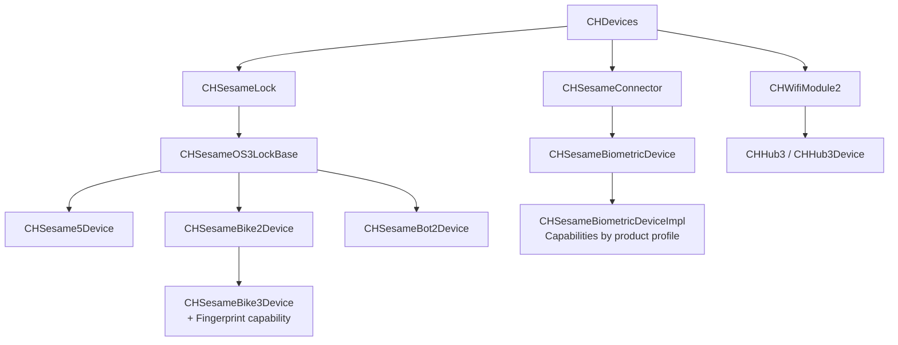

# SesameOS3 Android

日本語 | [简体中文](README_zh-CN.md) | [English](README_en.md)

CANDY HOUSE の Android アプリと Sesame SDK を収録したオープンソースプロジェクトです。現在は `co.candyhouse.sesame.ble.os3` を中心に、Sesame OS3 デバイスの BLE 接続、登録、操作、状態同期、ファームウェア更新を提供しています。

- [CANDY HOUSE 公式サイト](https://jp.candyhouse.co/)
- [Google Play](https://play.google.com/store/apps/details?id=co.candyhouse.sesame2)
- [GitHub Releases](https://github.com/CANDY-HOUSE/SesameSDK_Android_with_DemoApp/releases)

## SDK の導入

### 動作環境

- Android Studio
- JDK 17
- Android SDK 36
- minSdk 24

### 1. 依存関係を追加する

同じプロジェクト内のソースコードを使用する場合：

```groovy
dependencies {
    implementation project(':sesame-sdk')
}
```

JitPack を使用する場合、`settings.gradle` にリポジトリを追加します。

```groovy
dependencyResolutionManagement {
    repositories {
        google()
        mavenCentral()
        maven { url 'https://jitpack.io' }
    }
}
```

アプリの `build.gradle` に SDK を追加します。`<version>` は [Releases](https://github.com/CANDY-HOUSE/SesameSDK_Android_with_DemoApp/releases) にある利用したいタグへ置き換えてください。

```groovy
dependencies {
    implementation 'com.github.CANDY-HOUSE.SesameSDK_Android_with_DemoApp:sesame-sdk:<version>'
}
```

### 2. 権限を設定する

アプリの `AndroidManifest.xml` に必要な権限を追加し、BLE スキャン前に位置情報および Bluetooth の実行時権限を取得してください。

```xml
<uses-permission android:name="android.permission.ACCESS_FINE_LOCATION" />
<uses-permission android:name="android.permission.BLUETOOTH_SCAN" />
<uses-permission android:name="android.permission.BLUETOOTH_CONNECT" />
<uses-permission android:name="android.permission.INTERNET" />

<uses-feature
    android:name="android.hardware.bluetooth_le"
    android:required="false" />
```

### 3. CANDY HOUSE サービスを初期化する

Sesame OS3 の登録やクラウド機能を利用するには、アプリ起動時に以下を初期化します。

1. Amplify に `AWSCognitoAuthPlugin` と `AWSApiPlugin` を登録し、Cognito / API の設定で `Amplify.configure(...)` を実行する。
2. `CHAPIClientBiz.initialize(applicationContext)` を実行する。
3. `CHBleManager(applicationContext)` を実行する。

実装例は Demo App の [`AWSStatus.kt`](app/src/main/java/co/candyhouse/app/ext/aws/AWSStatus.kt) と [`BaseApp.kt`](app/src/main/java/co/candyhouse/app/base/BaseApp.kt) を参照してください。

```kotlin
override fun onCreate() {
    super.onCreate()

    // Amplify の Auth / API 設定後に初期化する
    CHAPIClientBiz.initialize(applicationContext)
    CHBleManager(applicationContext)
}
```

公開 Demo 用の CANDY HOUSE サービス設定は評価用途であり、リクエスト数などに制限がある場合があります。本番環境では、自分の Firebase / AWS / Google Maps 設定を使用し、認証情報をリポジトリへコミットしないでください。

Demo App を実行する場合は、次のローカル設定も必要です。

- `app.properties`：CANDY HOUSE API、AWS Cognito / IoT、Google Maps の設定
- `app/google-services.json`：Firebase の設定

### 4. デバイスを検出して登録する

権限取得後にスキャンを開始し、未登録デバイスを受け取ります。接続後、状態が `ReadyToRegister` になった時点で `register` を実行してください。

```kotlin
CHBleManager.delegate = object : CHBleManagerDelegate {
    override fun didDiscoverUnRegisteredCHDevices(devices: List<CHDevices>) {
        val device = devices.firstOrNull() ?: return

        device.delegate = object : CHDeviceStatusDelegate {
            override fun onBleDeviceStatusChanged(
                device: CHDevices,
                status: CHDeviceStatus,
                shadowStatus: CHDeviceStatus?
            ) {
                if (status == CHDeviceStatus.ReadyToRegister) {
                    device.register { result ->
                        result.onSuccess { /* 登録成功 */ }
                        result.onFailure { /* 登録失敗 */ }
                    }
                }
            }
        }

        device.connect { }
    }
}

CHBleManager.enableScan { result ->
    result.onFailure { /* 権限または Bluetooth の状態を確認 */ }
}
```

## プロジェクト構成

| モジュール | 内容 |
| --- | --- |
| `app` | デバイス、アカウント、フレンドなどを含む Android Demo App |
| `sesame-sdk` | BLE、OS3 デバイス実装、ローカル DB、クラウド通信 |
| `sesame-sdk/.../open` | 公開デバイス API、製品モデル、デバイス管理 |
| `sesame-sdk/.../ble/os3` | 現在メンテナンスしている OS3 プロトコルとデバイス実装 |

## OS3 デバイス構成


```mermaid
flowchart TB
    Devices[CHDevices]

    Devices --> Lock[CHSesameLock]
    Lock --> LockBase[CHSesameOS3LockBase]
    LockBase --> S5[CHSesame5Device]
    LockBase --> Bike2[CHSesameBike2Device]
    Bike2 --> Bike3[CHSesameBike3Device<br/>+ Fingerprint capability]
    LockBase --> Bot2[CHSesameBot2Device]

    Devices --> Connector[CHSesameConnector]
    Connector --> Bio[CHSesameBiometricDevice]
    Bio --> BioImpl[CHSesameBiometricDeviceImpl<br/>Capabilities by product profile]

    Devices --> Gateway[CHWifiModule2]
    Gateway --> Hub[CHHub3 / CHHub3Device]
```

### 対応製品

対応範囲は `CHProductModel` を基準とし、実際の Device 実装ごとに分類しています。

| Device 実装 | 製品 |
| --- | --- |
| `CHSesame5Device` | Sesame 5、Sesame 5 Pro、Sesame 5 US、Sesame 6、Sesame 6 Pro、Sesame 6 Pro SlidingDoor、Sesame miwa、BLE Connector 1 |
| `CHSesameBike2Device` | Sesame Bike 2 |
| `CHSesameBike3Device` | Sesame Bike 3（指紋機能を組み合わせ） |
| `CHSesameBot2Device` | Sesame Bot 2、Sesame Bot 3 |
| `CHSesameBiometricDeviceImpl` | Open Sensor 1/2、Remote、Remote Nano、Sesame Touch 1/1 Pro/2/2 Pro、Sesame Face 1/1 Pro/1 AI/1 Pro AI/2/2 Pro/2 AI/2 Pro AI |
| `CHHub3Device` | Hub 3、Hub 3 LTE |

> メンテナンス終了：Sesame 3（`SS2`）、WiFi Module 2（`WM2`）、Sesame Bot 1、Sesame Bike 1、Sesame 4（`SS4`）。

### 生体認証機能

`CHSesameBiometricDeviceImpl` は製品 Profile に応じて機能を組み合わせます。

| 製品シリーズ | 機能 |
| --- | --- |
| Touch | カード、指紋 |
| Touch Pro | カード、指紋、暗証番号 |
| Face | カード、指紋、手のひら、顔認証 |
| Face Pro | カード、指紋、暗証番号、手のひら、顔認証 |
| Face AI | 手のひら、顔認証 |
| Face Pro AI | 暗証番号、手のひら、顔認証 |

関連 API：`CHCardCapable`、`CHPassCodeCapable`、`CHFingerPrintCapable`、`CHPalmCapable`、`CHFaceCapable`、`CHRemoteNanoCapable`。

## ビルド

```bash
./gradlew :app:assembleDebug
```

## メンテナンス方針

- 新製品は `CHProductModel` に追加し、対応する OS3 Device 実装へマッピングします。
- 共通処理は基底クラスへ集約し、製品差分は個別実装または Capability の組み合わせで対応します。
- `co.candyhouse.sesame.ble.os2` は互換性維持のための旧コードであり、現在のメンテナンス対象外です。
