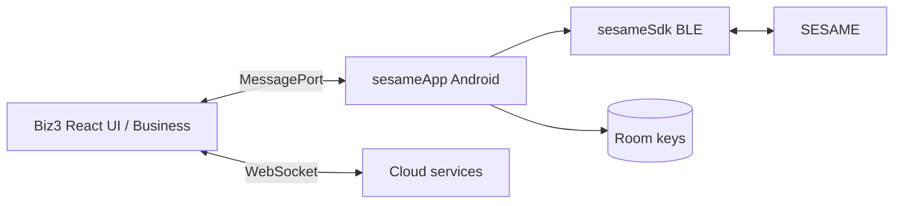
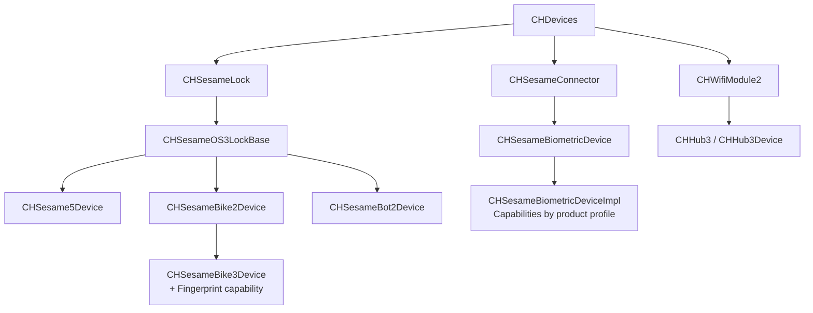
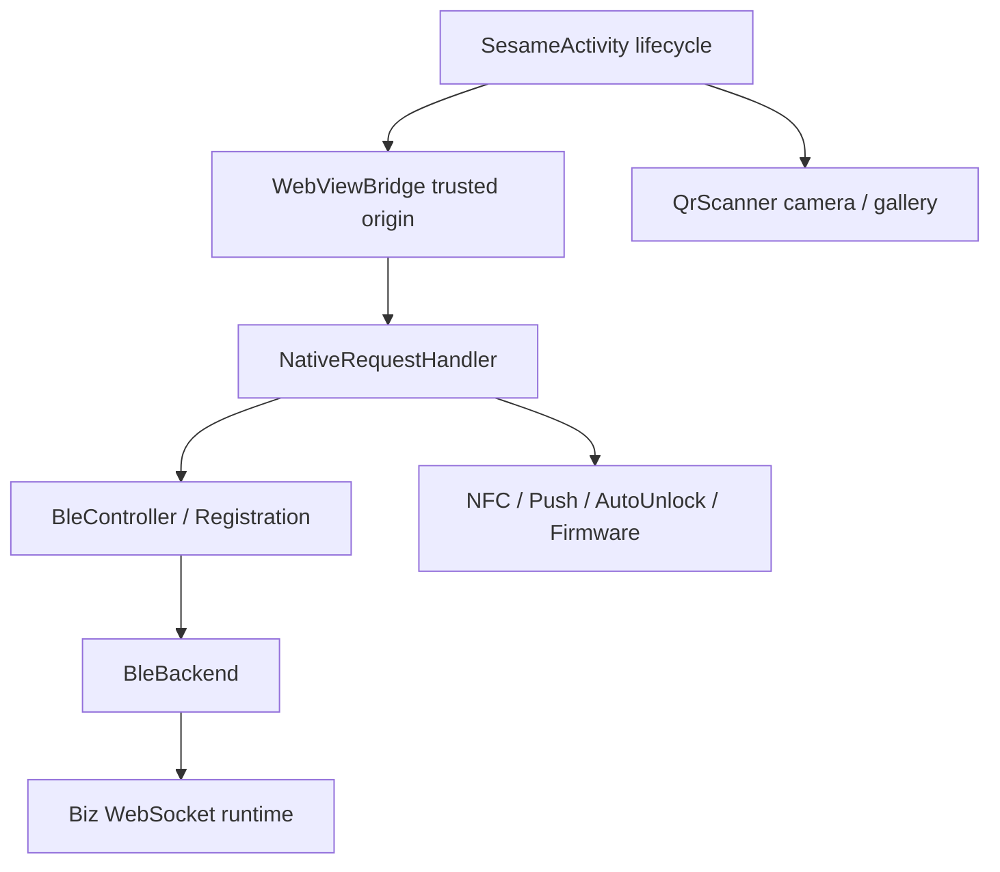
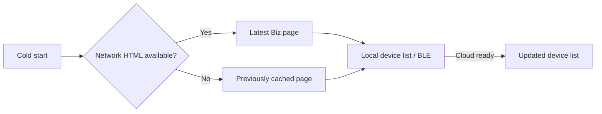

# SesameOS3 Android

[日本語](README.md) | [简体中文](README_zh-CN.md) | [English](README_en.md)

Android Web App のホストと独立した Sesame BLE SDK です。画面・アカウント・クラウド業務は Biz3、WebView・Bluetooth・OS 機能は Android が担当します。

**Biz は業務ロジック、Android はネイティブ機能、Bridge は通信を担当します。**


```mermaid
flowchart LR
  Biz[Biz3 React UI / Business] <-->|MessagePort| App[sesameApp Android]
  App --> SDK[sesameSdk BLE]
  SDK <--> Device[SESAME]
  App --> DB[(Room keys)]
  Biz <-->|WebSocket| AWS[Cloud services]
```

## 公開 SDK の導入

`sesameSdk` を Android アプリに組み込むことで、BLE スキャン・接続・登録・デバイス操作・状態通知を利用できます。Biz や Web App の導入は不要です。画面、アカウント、バックエンド、保存方式は導入側で選択します。

ソースのビルドには Android Studio とリポジトリの Gradle wrapper を使用します。`gradle/gradle-daemon-jvm.properties` は Gradle daemon に JDK 21 を指定し、両モジュールの Java ソースとバイトコードの互換レベルは 17 です。compileSdk は 36、アプリの targetSdk は 36、minSdk は 24 です。

### 1. 依存関係の追加

```groovy
dependencies {
    implementation project(':sesameSdk')
}
```

JitPack を利用する場合は `settings.gradle` にリポジトリを追加します。

```groovy
dependencyResolutionManagement {
    repositories {
        google()
        mavenCentral()
        maven { url 'https://jitpack.io' }
    }
}
```

続いてアプリの `build.gradle` に SDK の依存関係を追加します。

```groovy
dependencies {
    implementation 'com.github.CANDY-HOUSE.SesameSDK_Android_with_DemoApp:sesameSdk:<version>'
}
```

`<version>` を使用するリリースタグに置き換えてください。バージョンとモジュール座標は [JitPack ページ](https://jitpack.io/#CANDY-HOUSE/SesameSDK_Android_with_DemoApp) の公開成果物を参照してください。タグ一覧は [Releases](https://github.com/CANDY-HOUSE/SesameSDK_Android_with_DemoApp/releases) にあります。

### 2. 権限

SDK の Manifest に Bluetooth 権限を宣言しています。現在の `CHBleManager.enableScan` は対応するすべての Android バージョンで `ACCESS_FINE_LOCATION` を確認するため、ホスト側で宣言・取得してください。Android 12（API 31）以降は `BLUETOOTH_SCAN` と `BLUETOOTH_CONNECT` も必要です。これは現在の SDK 実装の要件であり、位置情報権限は旧 Android だけの要件ではありません。権限取得と Bluetooth 有効化の後にスキャンを開始します。

### 3. 初期化

Application で `CHBleSupport` と `CHBleManager` を初期化します。`backend` は登録・制限付き鍵の署名・デバイス情報通知を提供する `CHBleHost`、`keyStore` は鍵の保存と削除を担当する `CHKeyPersistence` の実装です。`gatewayTenantId` はゲートウェイ用のテナント識別子です。SDK はバックエンドの提供元、通信方式、DB を指定しません。インターフェースは [CHBleSupport.kt](sesameSdk/src/main/java/co/candyhouse/sesame/ble/CHBleSupport.kt) を参照してください。

```kotlin
CHBleSupport.initialize(backend, keyStore, gatewayTenantId)
CHBleManager(applicationContext)
```

### 4. スキャン・接続・登録

検出コールバックで未登録デバイスを表示します。ユーザーが選んだデバイスに接続し、`ReadyToRegister` になってから登録します。生成された鍵は `CHKeyPersistence` で保存します。

```kotlin
import co.candyhouse.sesame.ble.*

CHBleManager.delegate = object : CHBleManagerDelegate {
    override fun didDiscoverUnRegisteredCHDevices(devices: List<CHDevices>) {
        // Display discovered devices for the user to select.
    }
}
CHBleManager.enableScan { result ->
    result.onFailure { /* Handle permission or Bluetooth errors. */ }
}

fun registerDevice(device: CHDevices) {
    var registering = false
    device.delegate = object : CHDeviceStatusDelegate {
        override fun onBleDeviceStatusChanged(device: CHDevices, status: CHDeviceStatus) {
            if (status == CHDeviceStatus.ReadyToRegister && !registering) {
                registering = true
                device.register { result ->
                    result.onSuccess { /* Registration completed. */ }
                    result.onFailure { /* Handle registration failure. */ }
                }
            }
        }
    }
    device.connect { result ->
        result.onFailure { /* Handle connection failure. */ }
    }
}
```

### 5. 鍵の復元と BLE 操作

独自ストレージから `CHDevice`（下記の `savedKey`）を読み、`restoreDevice` で復元します。接続・機械状態の通知を受ける `CHDeviceStatusDelegate`（下記の `statusDelegate`）を設定してください。スキャンを継続し、BLE 認証完了後に操作コマンドを送信します。

```kotlin
val device = CHBleManager.restoreDevice(savedKey)
device?.delegate = statusDelegate
device?.connect { result ->
    result.onFailure { /* Handle connection failure. */ }
}

// After BLE authentication completes, for a CHSesame5-compatible device:
(device as? co.candyhouse.sesame.ble.os3.sesame5.CHSesame5)?.toggle { result ->
    result.onFailure { /* Handle command failure. */ }
}
```

機種に対応するインターフェースを使用します。対応する鍵は `CHSesame5`、その他は Bike・Bot・Biometric・Hub の各インターフェースを利用します。完全な鍵ではオフライン BLE 操作が可能です。制限付き鍵の認証には署名サービスが必要です。スキャン不要時は `CHBleManager.disableScan` を呼び出します。

## プロジェクト構成

| モジュール / パス | 役割 |
| --- | --- |
| `sesameApp` | Android アプリ：WebView ホスト、BLE ブリッジ、OS 機能 |
| `sesameSdk` | 独立 BLE SDK：スキャン・接続・登録・操作・状態通知 |
| `sesameSdk/src/main/java/co/candyhouse/sesame/ble` | 公開デバイスインターフェース、製品モデル、BLE 管理 |
| `sesameSdk/src/main/java/co/candyhouse/sesame/ble/os3` | Sesame OS3 プロトコルとデバイス実装 |
| `sesameApp/src/main/java/co/candyhouse/app/data` | アプリ側の鍵永続化 |
| `app.properties` | アプリ共通設定と Web App 環境 URL |

## OS3 デバイス構成


```mermaid
flowchart TB
    Devices[CHDevices]

    Devices --> Lock[CHSesameLock]
    Lock --> LockBase[CHSesameOS3LockBase]
    LockBase --> S5[CHSesame5Device]
    LockBase --> Bike2[CHSesameBike2Device]
    Bike2 --> Bike3[CHSesameBike3Device<br/>+ Fingerprint capability]
    LockBase --> Bot2[CHSesameBot2Device]

    Devices --> Connector[CHSesameConnector]
    Connector --> Bio[CHSesameBiometricDevice]
    Bio --> BioImpl[CHSesameBiometricDeviceImpl<br/>Capabilities by product profile]

    Devices --> Gateway[CHWifiModule2]
    Gateway --> Hub[CHHub3 / CHHub3Device]
```

### 対応製品

対応範囲は `CHProductModel` を基準とし、実際の Device 実装ごとに分類しています。

| Device 実装 | 製品 |
| --- | --- |
| `CHSesame5Device` | Sesame 5、Sesame 5 Pro、Sesame 5 US、Sesame 6、Sesame 6 Pro、Sesame 6 Pro SlidingDoor、Sesame miwa、BLE Connector 1 |
| `CHSesameBike2Device` | Sesame Bike 2 |
| `CHSesameBike3Device` | Sesame Bike 3（指紋機能を組み合わせ） |
| `CHSesameBot2Device` | Sesame Bot 2、Sesame Bot 3 |
| `CHSesameBiometricDeviceImpl` | Open Sensor 1/2、Remote、Remote Nano、Sesame Touch 1/1 Pro/2/2 Pro、Sesame Face 1/1 Pro/1 AI/1 Pro AI/2/2 Pro/2 AI/2 Pro AI/3 |
| `CHHub3Device` | Hub 3、Hub 3 Pro |

> メンテナンス終了：Sesame 3（`SS2`）、WiFi Module 2（`WM2`）、Sesame Bot 1、Sesame Bike 1、Sesame 4（`SS4`）。これらの旧モデルは `CHProductModel` と各実装に残っています。上記の OS3 製品表には含めていません。

### 生体認証機能

`CHSesameBiometricDeviceImpl` は製品 Profile に応じて機能を組み合わせます。

| 製品シリーズ | 機能 |
| --- | --- |
| Touch | カード、指紋 |
| Touch Pro | カード、指紋、暗証番号 |
| Face | カード、指紋、手のひら、顔認証 |
| Face Pro | カード、指紋、暗証番号、手のひら、顔認証 |
| Face AI | 手のひら、顔認証 |
| Face Pro AI | 暗証番号、手のひら、顔認証 |

関連 API：`CHCardCapable`、`CHPassCodeCapable`、`CHFingerPrintCapable`、`CHPalmCapable`、`CHFaceCapable`、`CHRemoteNanoCapable`。

## 内部開発

プロジェクト共通設定は `app.properties` に保持し、ルートの `build.gradle` で読み込み、プライベートリポジトリで管理します。`local.properties` は `sdk.dir` など開発者のローカル設定専用とし、Git にコミットしません。Firebase 設定は `sesameApp/google-services.json` です。

```properties
aws.cognito.identityPoolId=<YOUR_IDENTITY_POOL_ID>
aws.cognito.userPoolId=<YOUR_USER_POOL_ID>
aws.cognito.appClientId=<YOUR_APP_CLIENT_ID>
google.maps.apiKey=<YOUR_MAPS_KEY>
candyhouse.sesame.web.dev=http://localhost:3000
candyhouse.sesame.web.prod=https://pre-app-h5.d36dwtby1bef9y.amplifyapp.com
```

Debug のページ URL は `candyhouse.sesame.web.dev`、Release/CI は `candyhouse.sesame.web.prod` で指定します。Android のブランチ名とは独立して、Biz のステージング環境または本番環境を選択できます。Biz のステージングブランチは個別に配信でき、本番 URL は `https://biz.candyhouse.co` です。APP のページ URL を変更した場合は Android を再ビルドします。

現在の `app.properties` の Release/CI URL は、本番ではなくステージングを指しています。

Web APP ルートから、それぞれ別のターミナルで実行します。Biz の開発サーバーは起動したままにします。

```bash
# Terminal 1: Biz3
cd Biz3
nvm use
yarn install --frozen-lockfile
yarn dev
```

```bash
# Terminal 2: Android
cd SesameOS3_Android
adb reverse tcp:3000 tcp:3000
./gradlew :sesameApp:assembleDebug
```

## 役割分担

Biz は業務ルール・状態管理・画面操作・クラウド要求を実装します。Android は WebView・BLE・権限・永続化・OS 機能を提供します。Bridge は信頼元の検証と要求・応答・イベントの通信を担当し、業務ロジックを持ちません。


```mermaid
flowchart TB
  Activity[SesameActivity lifecycle] --> Bridge[WebViewBridge trusted origin]
  Activity --> QR[QrScanner camera / gallery]
  Bridge --> Handler[NativeRequestHandler]
  Handler --> BLE[BleController / Registration]
  Handler --> Platform[NFC / Push / AutoUnlock / Firmware]
  BLE --> Backend[BleBackend]
  Backend --> Biz[Biz WebSocket runtime]
```

Amplify Auth は旧ログインの引き継ぎ、core-kotlin は現在の suspend API 用です。Amplify API プラグインはありません。バックグラウンド WebView も Biz のクラウド接続を利用し、NFC・通知・自動解錠・ファームウェア転送・QR は各ネイティブ機能が担当します。

## 起動とオフライン


```mermaid
flowchart LR
  Start[Cold start] --> Page{Network HTML available?}
  Page -->|Yes| Online[Latest Biz page]
  Page -->|No| Cache[Previously cached page]
  Online --> Local[Local device list / BLE]
  Cache --> Local
  Local -->|Cloud ready| Cloud[Updated device list]
```

APK に Biz の画面資源を同梱しません。Service Worker は HTML をネットワーク優先で取得し、必要な資源のキャッシュ成功後にオフライン入口を保存します。初回インストール・ドメイン変更・WebView データ削除後は一度オンラインで起動してください。OS によるキャッシュ削除があるため、未接続の初回起動は保証しません。

オフライン一覧はローカル DB から取得し、Cognito・WebSocket を待ちません。`offlineDevices` は名前・モデル・UUID・権限レベルのみを返し、鍵は返しません。オンラインの登録、鍵の同期・共有、制限付き鍵の署名では、必要な鍵情報が信頼された Bridge を通過します。オフライン一覧の制限は、すべての鍵が Biz を通らないことを意味しません。完全なオンライン一覧で表示範囲を更新し、ログアウトしたアカウントの再表示を防ぎます。未同期鍵は保持します。制限付き鍵の署名、クラウド操作、登録、ファームウェア取得には通信が必要です。

同じ applicationId・互換署名・許可される versionCode による上書き更新では、データを消去しなければ DB と設定を引き継ぎます。LegacySession が旧ログインを、KeyHandoff がゲスト鍵の同期を担当します。
