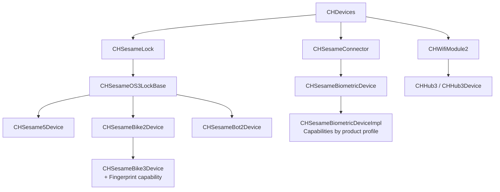

# SesameOS3 Android

[日本語](README.md) | [简体中文](README_zh-CN.md) | English

An open-source project containing the CANDY HOUSE Android app and Sesame SDK. The project currently focuses on `co.candyhouse.sesame.ble.os3` and provides BLE connectivity, registration, control, state synchronization, and firmware updates for Sesame OS3 devices.

- [CANDY HOUSE official website](https://jp.candyhouse.co/)
- [Google Play](https://play.google.com/store/apps/details?id=co.candyhouse.sesame2)
- [GitHub Releases](https://github.com/CANDY-HOUSE/SesameSDK_Android_with_DemoApp/releases)

## Integrating the SDK

### Requirements

- Android Studio
- JDK 17
- Android SDK 36
- minSdk 24

### 1. Add the dependency

To use the source module in the same project:

```groovy
dependencies {
    implementation project(':sesame-sdk')
}
```

To use JitPack, add the repository to `settings.gradle`:

```groovy
dependencyResolutionManagement {
    repositories {
        google()
        mavenCentral()
        maven { url 'https://jitpack.io' }
    }
}
```

Then add the SDK to your app's `build.gradle`. Replace `<version>` with the desired tag from [Releases](https://github.com/CANDY-HOUSE/SesameSDK_Android_with_DemoApp/releases).

```groovy
dependencies {
    implementation 'com.github.CANDY-HOUSE.SesameSDK_Android_with_DemoApp:sesame-sdk:<version>'
}
```

### 2. Configure permissions

Add the required permissions to your app's `AndroidManifest.xml`. Request location and Bluetooth runtime permissions before starting a BLE scan.

```xml
<uses-permission android:name="android.permission.ACCESS_FINE_LOCATION" />
<uses-permission android:name="android.permission.BLUETOOTH_SCAN" />
<uses-permission android:name="android.permission.BLUETOOTH_CONNECT" />
<uses-permission android:name="android.permission.INTERNET" />

<uses-feature
    android:name="android.hardware.bluetooth_le"
    android:required="false" />
```

### 3. Initialize CANDY HOUSE services

To use Sesame OS3 registration and cloud features, complete the following initialization when your application starts:

1. Add `AWSCognitoAuthPlugin` and `AWSApiPlugin` to Amplify, then call `Amplify.configure(...)` with your Cognito and API configuration.
2. Call `CHAPIClientBiz.initialize(applicationContext)`.
3. Call `CHBleManager(applicationContext)`.

See [`AWSStatus.kt`](app/src/main/java/co/candyhouse/app/ext/aws/AWSStatus.kt) and [`BaseApp.kt`](app/src/main/java/co/candyhouse/app/base/BaseApp.kt) in the Demo App for complete examples.

```kotlin
override fun onCreate() {
    super.onCreate()

    // Initialize after configuring Amplify Auth and API
    CHAPIClientBiz.initialize(applicationContext)
    CHBleManager(applicationContext)
}
```

The public Demo configuration for CANDY HOUSE services is intended for evaluation and may be subject to request or usage limits. For production, use your own Firebase, AWS, and Google Maps configuration, and never commit credentials to the repository.

The Demo App also requires the following local configuration files:

- `app.properties`: CANDY HOUSE API, AWS Cognito/IoT, and Google Maps configuration
- `app/google-services.json`: Firebase configuration

### 4. Discover and register a device

After permissions are granted, start scanning and listen for unregistered devices. Connect to a device and call `register` when its state becomes `ReadyToRegister`.

```kotlin
CHBleManager.delegate = object : CHBleManagerDelegate {
    override fun didDiscoverUnRegisteredCHDevices(devices: List<CHDevices>) {
        val device = devices.firstOrNull() ?: return

        device.delegate = object : CHDeviceStatusDelegate {
            override fun onBleDeviceStatusChanged(
                device: CHDevices,
                status: CHDeviceStatus,
                shadowStatus: CHDeviceStatus?
            ) {
                if (status == CHDeviceStatus.ReadyToRegister) {
                    device.register { result ->
                        result.onSuccess { /* Registration succeeded */ }
                        result.onFailure { /* Registration failed */ }
                    }
                }
            }
        }

        device.connect { }
    }
}

CHBleManager.enableScan { result ->
    result.onFailure { /* Check permissions or Bluetooth state */ }
}
```

## Project structure

| Module | Description |
| --- | --- |
| `app` | Android Demo App with device, account, and friend-related screens and flows |
| `sesame-sdk` | BLE, OS3 device implementations, local database, and cloud communication |
| `sesame-sdk/.../open` | Public device APIs, product models, and device management |
| `sesame-sdk/.../ble/os3` | Currently maintained OS3 protocol and device implementations |

## OS3 device architecture



### Supported products

The supported product range is defined by `CHProductModel` and grouped below by the actual Device implementation.

| Device implementation | Products |
| --- | --- |
| `CHSesame5Device` | Sesame 5, Sesame 5 Pro, Sesame 5 US, Sesame 6, Sesame 6 Pro, Sesame 6 Pro SlidingDoor, Sesame miwa, BLE Connector 1 |
| `CHSesameBike2Device` | Sesame Bike 2 |
| `CHSesameBike3Device` | Sesame Bike 3 (with fingerprint capability) |
| `CHSesameBot2Device` | Sesame Bot 2, Sesame Bot 3 |
| `CHSesameBiometricDeviceImpl` | Open Sensor 1/2, Remote, Remote Nano, Sesame Touch 1/1 Pro/2/2 Pro, Sesame Face 1/1 Pro/1 AI/1 Pro AI/2/2 Pro/2 AI/2 Pro AI |
| `CHHub3Device` | Hub 3, Hub 3 LTE |

> No longer maintained: Sesame 3 (`SS2`), WiFi Module 2 (`WM2`), Sesame Bot 1, Sesame Bike 1, and Sesame 4 (`SS4`).

### Biometric capabilities

`CHSesameBiometricDeviceImpl` assembles capabilities based on each product profile.

| Product family | Capabilities |
| --- | --- |
| Touch | Card, fingerprint |
| Touch Pro | Card, fingerprint, passcode |
| Face | Card, fingerprint, palm, face |
| Face Pro | Card, fingerprint, passcode, palm, face |
| Face AI | Palm, face |
| Face Pro AI | Passcode, palm, face |

Related APIs: `CHCardCapable`, `CHPassCodeCapable`, `CHFingerPrintCapable`, `CHPalmCapable`, `CHFaceCapable`, and `CHRemoteNanoCapable`.

## Build

```bash
./gradlew :app:assembleDebug
```

## Maintenance policy

- Add new products to `CHProductModel` and map them to the corresponding OS3 Device implementation.
- Keep shared behavior in base classes; implement product differences through dedicated implementations or Capability composition.
- `co.candyhouse.sesame.ble.os2` contains legacy compatibility code and is outside the current maintenance scope.
