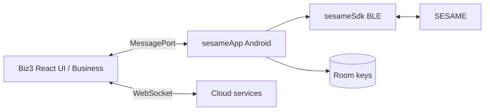
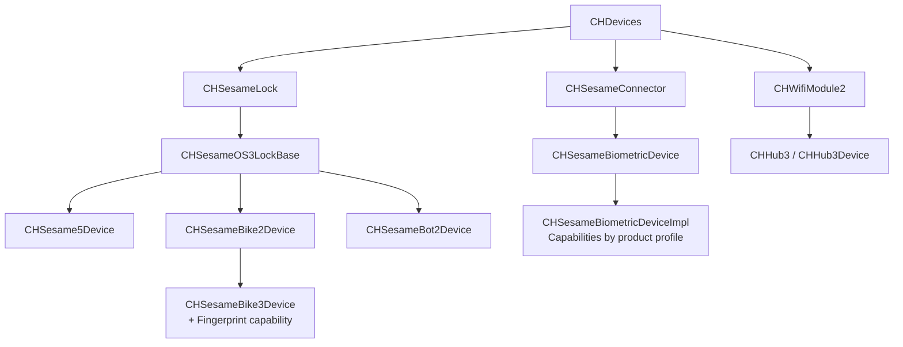
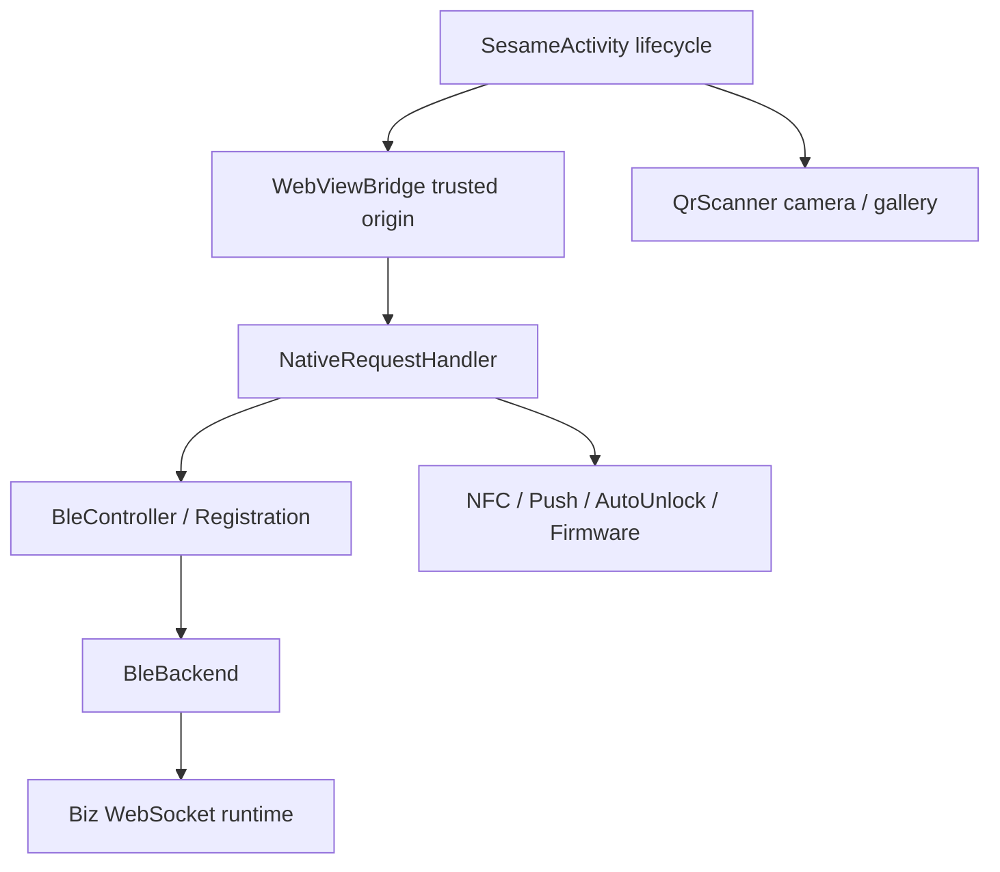
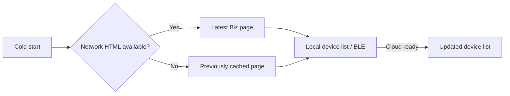

# SesameOS3 Android

[日本語](README.md) | [简体中文](README_zh-CN.md) | [English](README_en.md)

Android Web App host and standalone Sesame BLE SDK. Biz3 owns pages, accounts and cloud business logic; Android supplies WebView, Bluetooth and platform capabilities.


```mermaid
flowchart LR
  Biz[Biz3 React UI / Business] <-->|MessagePort| App[sesameApp Android]
  App --> SDK[sesameSdk BLE]
  SDK <--> Device[SESAME]
  App --> DB[(Room keys)]
  Biz <-->|WebSocket| AWS[Cloud services]
```

## Public SDK integration

Integrate `sesameSdk` into your Android application for BLE discovery, connection, registration, device control and status callbacks. Biz and Web App integration are not required. Your application chooses its UI, accounts, backend and storage.

Android Studio, JDK 17, Android SDK 36; minSdk 24.

### 1. Add the dependency

```groovy
dependencies {
    implementation project(':sesameSdk')
}
```

To use JitPack, add the repository in `settings.gradle`:

```groovy
dependencyResolutionManagement {
    repositories {
        google()
        mavenCentral()
        maven { url 'https://jitpack.io' }
    }
}
```

Then add the SDK dependency in the application’s `build.gradle`:

```groovy
dependencies {
    implementation 'com.github.CANDY-HOUSE.SesameSDK_Android_with_DemoApp:sesameSdk:<version>'
}
```

Replace `<version>` with the desired release tag. Use the version and module coordinates listed on the [JitPack page](https://jitpack.io/#CANDY-HOUSE/SesameSDK_Android_with_DemoApp); tags are available in [Releases](https://github.com/CANDY-HOUSE/SesameSDK_Android_with_DemoApp/releases).

### 2. Permissions

The SDK manifest declares Bluetooth permissions. Request the runtime permissions required for scanning and connecting on the target Android version; configure location permission where required for scanning on older Android versions. Start scanning after permissions are granted and Bluetooth is enabled.

### 3. Initialize

Initialize `CHBleSupport` and `CHBleManager` in your Application. `backend` implements `CHBleHost` for registration, restricted-key signing and device-data callbacks. `keyStore` implements `CHKeyPersistence` to save and delete keys; `gatewayTenantId` identifies the gateway tenant. The SDK does not prescribe a backend provider, transport or database. See [CHBleSupport.kt](sesameSdk/src/main/java/co/candyhouse/sesame/ble/CHBleSupport.kt) for the interfaces.

```kotlin
CHBleSupport.initialize(backend, keyStore, gatewayTenantId)
CHBleManager(applicationContext)
```

### 4. Discover, connect and register

Display unregistered devices from the discovery callback. Connect to the device selected by the user and register after it reaches `ReadyToRegister`. Registration keys are saved through `CHKeyPersistence`.

```kotlin
import co.candyhouse.sesame.ble.*

CHBleManager.delegate = object : CHBleManagerDelegate {
    override fun didDiscoverUnRegisteredCHDevices(devices: List<CHDevices>) {
        // Display discovered devices for the user to select.
    }
}
CHBleManager.enableScan { result ->
    result.onFailure { /* Handle permission or Bluetooth errors. */ }
}

fun registerDevice(device: CHDevices) {
    var registering = false
    device.delegate = object : CHDeviceStatusDelegate {
        override fun onBleDeviceStatusChanged(device: CHDevices, status: CHDeviceStatus) {
            if (status == CHDeviceStatus.ReadyToRegister && !registering) {
                registering = true
                device.register { result ->
                    result.onSuccess { /* Registration completed. */ }
                    result.onFailure { /* Handle registration failure. */ }
                }
            }
        }
    }
    device.connect { result ->
        result.onFailure { /* Handle connection failure. */ }
    }
}
```

### 5. Restore keys and control devices

Read a `CHDevice` from your own storage (`savedKey` below), restore it with `restoreDevice`, and assign a `CHDeviceStatusDelegate` (`statusDelegate` below) for connection and mechanical-state updates. Keep scanning enabled and wait for BLE authentication before sending commands.

```kotlin
val device = CHBleManager.restoreDevice(savedKey)
device?.delegate = statusDelegate
device?.connect { result ->
    result.onFailure { /* Handle connection failure. */ }
}

// After BLE authentication completes, for a CHSesame5-compatible device:
(device as? co.candyhouse.sesame.ble.os3.sesame5.CHSesame5)?.toggle { result ->
    result.onFailure { /* Handle command failure. */ }
}
```

Use the interface for the actual device: `CHSesame5` for compatible locks, or the relevant Bike, Bot, Biometric or Hub interface. Full keys support offline BLE operation; restricted-key authentication requires a signing service. Call `CHBleManager.disableScan` when scanning is no longer needed.

## Project structure

| Module / path | Responsibility |
| --- | --- |
| `sesameApp` | Android application: WebView host, BLE bridge and platform capabilities |
| `sesameSdk` | Standalone BLE SDK: discovery, connection, registration, control and status callbacks |
| `sesameSdk/src/main/java/co/candyhouse/sesame/ble` | Public device interfaces, product models and BLE management |
| `sesameSdk/src/main/java/co/candyhouse/sesame/ble/os3` | Sesame OS3 protocols and device implementations |
| `sesameApp/src/main/java/co/candyhouse/app/data` | Application-side key persistence |
| `app.properties` | Shared application configuration and Web App environment URLs |

## OS3 device architecture


```mermaid
flowchart TB
    Devices[CHDevices]

    Devices --> Lock[CHSesameLock]
    Lock --> LockBase[CHSesameOS3LockBase]
    LockBase --> S5[CHSesame5Device]
    LockBase --> Bike2[CHSesameBike2Device]
    Bike2 --> Bike3[CHSesameBike3Device<br/>+ Fingerprint capability]
    LockBase --> Bot2[CHSesameBot2Device]

    Devices --> Connector[CHSesameConnector]
    Connector --> Bio[CHSesameBiometricDevice]
    Bio --> BioImpl[CHSesameBiometricDeviceImpl<br/>Capabilities by product profile]

    Devices --> Gateway[CHWifiModule2]
    Gateway --> Hub[CHHub3 / CHHub3Device]
```

### Supported products

The supported product range is defined by `CHProductModel` and grouped below by the actual Device implementation.

| Device implementation | Products |
| --- | --- |
| `CHSesame5Device` | Sesame 5, Sesame 5 Pro, Sesame 5 US, Sesame 6, Sesame 6 Pro, Sesame 6 Pro SlidingDoor, Sesame miwa, BLE Connector 1 |
| `CHSesameBike2Device` | Sesame Bike 2 |
| `CHSesameBike3Device` | Sesame Bike 3 (with fingerprint capability) |
| `CHSesameBot2Device` | Sesame Bot 2, Sesame Bot 3 |
| `CHSesameBiometricDeviceImpl` | Open Sensor 1/2, Remote, Remote Nano, Sesame Touch 1/1 Pro/2/2 Pro, Sesame Face 1/1 Pro/1 AI/1 Pro AI/2/2 Pro/2 AI/2 Pro AI |
| `CHHub3Device` | Hub 3, Hub 3 Pro |

> No longer maintained: Sesame 3 (`SS2`), WiFi Module 2 (`WM2`), Sesame Bot 1, Sesame Bike 1, and Sesame 4 (`SS4`).

### Biometric capabilities

`CHSesameBiometricDeviceImpl` assembles capabilities based on each product profile.

| Product family | Capabilities |
| --- | --- |
| Touch | Card, fingerprint |
| Touch Pro | Card, fingerprint, passcode |
| Face | Card, fingerprint, palm, face |
| Face Pro | Card, fingerprint, passcode, palm, face |
| Face AI | Palm, face |
| Face Pro AI | Passcode, palm, face |

Related APIs: `CHCardCapable`, `CHPassCodeCapable`, `CHFingerPrintCapable`, `CHPalmCapable`, `CHFaceCapable`, and `CHRemoteNanoCapable`.

## Internal development

Keep shared project configuration in `app.properties`, loaded by the root `build.gradle` and managed in the private repository. Use ignored `local.properties` only for developer-specific settings such as `sdk.dir`. Use your Firebase configuration in `sesameApp/google-services.json`.

```properties
aws.cognito.identityPoolId=<YOUR_IDENTITY_POOL_ID>
aws.cognito.userPoolId=<YOUR_USER_POOL_ID>
aws.cognito.appClientId=<YOUR_APP_CLIENT_ID>
google.maps.apiKey=<YOUR_MAPS_KEY>
candyhouse.sesame.web.dev=http://localhost:3000
candyhouse.sesame.web.prod=https://pre-app-h5.d36dwtby1bef9y.amplifyapp.com
```

`candyhouse.sesame.web.dev` selects the Debug page URL; `candyhouse.sesame.web.prod` selects the Release/CI page URL. These settings select the Biz staging or production environment independently of the Android branch name. The Biz staging branch can be deployed independently; production is `https://biz.candyhouse.co`. Rebuild Android after changing its page URL.

```bash
# Biz3
cd ../Biz3
yarn install
yarn dev
# Android
adb reverse tcp:3000 tcp:3000
cd ../SesameOS3_Android
./gradlew :sesameApp:assembleDebug
```

## Responsibilities


```mermaid
flowchart TB
  Activity[SesameActivity lifecycle] --> Bridge[WebViewBridge trusted origin]
  Activity --> QR[QrScanner camera / gallery]
  Bridge --> Handler[NativeRequestHandler]
  Handler --> BLE[BleController / Registration]
  Handler --> Platform[NFC / Push / AutoUnlock / Firmware]
  BLE --> Backend[BleBackend]
  Backend --> Biz[Biz WebSocket runtime]
```

Amplify Auth remains for legacy session handoff; core-kotlin supplies the suspend APIs currently used. There is no Amplify API plugin. The background WebView reuses Biz cloud transport; native components handle NFC, notifications, auto-unlock, firmware transfer and scanning.

## Startup and offline operation


```mermaid
flowchart LR
  Start[Cold start] --> Page{Network HTML available?}
  Page -->|Yes| Online[Latest Biz page]
  Page -->|No| Cache[Previously cached page]
  Online --> Local[Local device list / BLE]
  Cache --> Local
  Local -->|Cloud ready| Cloud[Updated device list]
```

The APK contains no Biz page bundle. A Service Worker loads HTML from the network first and publishes the cached entry after its assets are cached successfully. Offline starts reuse that page. A first installation, new origin or cleared WebView storage needs one online visit. The OS may evict caches; a never-online start is not guaranteed.

Offline devices come from the local database, without waiting for Cognito or WebSocket. Only display metadata crosses the offline bridge; keys stay native. A complete online list updates local visibility so signed-out accounts do not reappear; pending keys survive. Restricted keys still require online signing. Cloud actions, registration and firmware downloads need connectivity.

An in-place update with the same applicationId, compatible signing and permitted versionCode preserves the database and preferences unless data is cleared. LegacySession bridges previous logins; KeyHandoff queues guest keys for synchronization.
