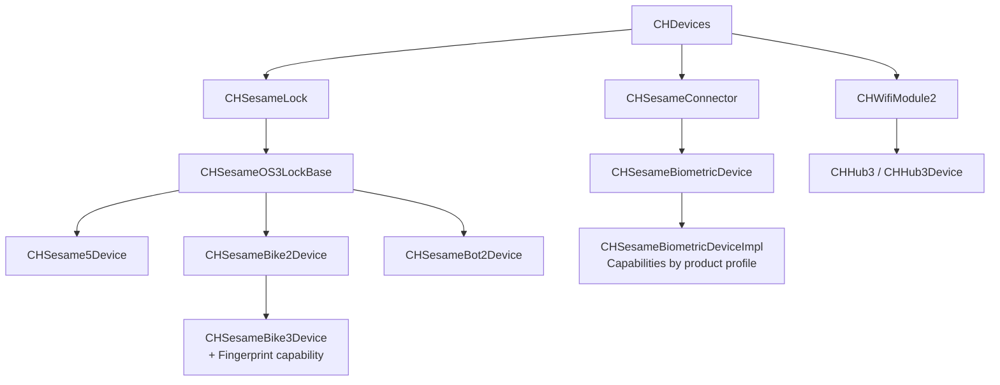

# SesameOS3 Android

[日本語](README.md) | 简体中文 | [English](README_en.md)

CANDY HOUSE Android 应用与 Sesame SDK 开源项目。当前项目聚焦于 `co.candyhouse.sesame.ble.os3`，提供 Sesame OS3 设备的 BLE 连接、注册、控制、状态同步与固件升级能力。

- [CANDY HOUSE 官网](https://jp.candyhouse.co/)
- [Google Play](https://play.google.com/store/apps/details?id=co.candyhouse.sesame2)
- [GitHub Releases](https://github.com/CANDY-HOUSE/SesameSDK_Android_with_DemoApp/releases)

## 接入 SDK

### 开发环境

- Android Studio
- JDK 17
- Android SDK 36
- minSdk 24

### 1. 添加依赖

在同一项目内直接使用源码：

```groovy
dependencies {
    implementation project(':sesame-sdk')
}
```

通过 JitPack 接入时，先在 `settings.gradle` 中添加仓库：

```groovy
dependencyResolutionManagement {
    repositories {
        google()
        mavenCentral()
        maven { url 'https://jitpack.io' }
    }
}
```

然后在应用的 `build.gradle` 中添加 SDK。请将 `<version>` 替换为 [Releases](https://github.com/CANDY-HOUSE/SesameSDK_Android_with_DemoApp/releases) 中需要使用的版本标签。

```groovy
dependencies {
    implementation 'com.github.CANDY-HOUSE.SesameSDK_Android_with_DemoApp:sesame-sdk:<version>'
}
```

### 2. 配置权限

在应用的 `AndroidManifest.xml` 中添加必要权限，并在开始 BLE 扫描前申请定位及蓝牙运行时权限。

```xml
<uses-permission android:name="android.permission.ACCESS_FINE_LOCATION" />
<uses-permission android:name="android.permission.BLUETOOTH_SCAN" />
<uses-permission android:name="android.permission.BLUETOOTH_CONNECT" />
<uses-permission android:name="android.permission.INTERNET" />

<uses-feature
    android:name="android.hardware.bluetooth_le"
    android:required="false" />
```

### 3. 初始化 CANDY HOUSE 服务

使用 Sesame OS3 注册和云端功能时，需要在应用启动阶段完成以下初始化：

1. 向 Amplify 注册 `AWSCognitoAuthPlugin` 和 `AWSApiPlugin`，通过 Cognito/API 配置执行 `Amplify.configure(...)`。
2. 调用 `CHAPIClientBiz.initialize(applicationContext)`。
3. 调用 `CHBleManager(applicationContext)`。

具体实现可参考 Demo App 中的 [`AWSStatus.kt`](app/src/main/java/co/candyhouse/app/ext/aws/AWSStatus.kt) 和 [`BaseApp.kt`](app/src/main/java/co/candyhouse/app/base/BaseApp.kt)。

```kotlin
override fun onCreate() {
    super.onCreate()

    // 完成 Amplify Auth/API 配置后再初始化
    CHAPIClientBiz.initialize(applicationContext)
    CHBleManager(applicationContext)
}
```

公共 Demo 使用的 CANDY HOUSE 服务配置仅供评估，可能存在请求次数等限制。生产环境请使用自己的 Firebase、AWS 与 Google Maps 配置，并且不要把任何凭证提交到代码仓库。

运行 Demo App 还需要准备以下本地配置：

- `app.properties`：CANDY HOUSE API、AWS Cognito/IoT、Google Maps 配置
- `app/google-services.json`：Firebase 配置

### 4. 发现并注册设备

获得权限后启动扫描，通过回调接收未注册设备。设备连接成功并进入 `ReadyToRegister` 状态后调用 `register`。

```kotlin
CHBleManager.delegate = object : CHBleManagerDelegate {
    override fun didDiscoverUnRegisteredCHDevices(devices: List<CHDevices>) {
        val device = devices.firstOrNull() ?: return

        device.delegate = object : CHDeviceStatusDelegate {
            override fun onBleDeviceStatusChanged(
                device: CHDevices,
                status: CHDeviceStatus,
                shadowStatus: CHDeviceStatus?
            ) {
                if (status == CHDeviceStatus.ReadyToRegister) {
                    device.register { result ->
                        result.onSuccess { /* 注册成功 */ }
                        result.onFailure { /* 注册失败 */ }
                    }
                }
            }
        }

        device.connect { }
    }
}

CHBleManager.enableScan { result ->
    result.onFailure { /* 检查权限或蓝牙状态 */ }
}
```

## 项目结构

| 模块 | 说明 |
| --- | --- |
| `app` | Android Demo App，包含设备、账户、好友等界面与业务流程 |
| `sesame-sdk` | Sesame SDK，包含 BLE、OS3 设备实现、本地数据库及云端通信 |
| `sesame-sdk/.../open` | 对外设备接口、产品型号与设备管理入口 |
| `sesame-sdk/.../ble/os3` | 当前维护的 Sesame OS3 协议与设备实现 |

## OS3 设备架构



### 当前维护产品

产品范围以 `CHProductModel` 为准，按实际 Device 实现分组：

| Device 实现 | 产品 |
| --- | --- |
| `CHSesame5Device` | Sesame 5、Sesame 5 Pro、Sesame 5 US、Sesame 6、Sesame 6 Pro、Sesame 6 Pro SlidingDoor、Sesame miwa、BLE Connector 1 |
| `CHSesameBike2Device` | Sesame Bike 2 |
| `CHSesameBike3Device` | Sesame Bike 3（组合指纹能力） |
| `CHSesameBot2Device` | Sesame Bot 2、Sesame Bot 3 |
| `CHSesameBiometricDeviceImpl` | Open Sensor 1/2、Remote、Remote Nano、Sesame Touch 1/1 Pro/2/2 Pro、Sesame Face 1/1 Pro/1 AI/1 Pro AI/2/2 Pro/2 AI/2 Pro AI |
| `CHHub3Device` | Hub 3、Hub 3 LTE |

> 不再维护：Sesame 3（`SS2`）、WiFi Module 2（`WM2`）、Sesame Bot 1、Sesame Bike 1、Sesame 4（`SS4`）。

### 生物识别能力

`CHSesameBiometricDeviceImpl` 通过产品 Profile 组合能力：

| 产品系列 | 能力 |
| --- | --- |
| Touch | 卡片、指纹 |
| Touch Pro | 卡片、指纹、密码 |
| Face | 卡片、指纹、掌纹、人脸 |
| Face Pro | 卡片、指纹、密码、掌纹、人脸 |
| Face AI | 掌纹、人脸 |
| Face Pro AI | 密码、掌纹、人脸 |

相关接口包括 `CHCardCapable`、`CHPassCodeCapable`、`CHFingerPrintCapable`、`CHPalmCapable`、`CHFaceCapable` 与 `CHRemoteNanoCapable`。

## 构建

```bash
./gradlew :app:assembleDebug
```

## 维护约定

- 新产品需先在 `CHProductModel` 中登记，并映射到对应的 OS3 Device 实现。
- 共性行为优先收敛到基础类；产品差异通过独立实现或 Capability 组合完成。
- `co.candyhouse.sesame.ble.os2` 仅为历史兼容代码，不属于当前维护范围。
