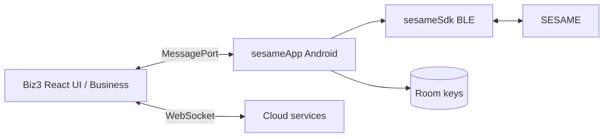
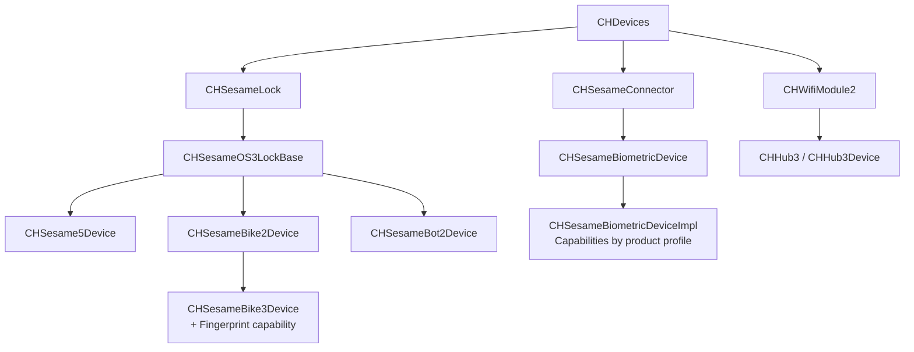
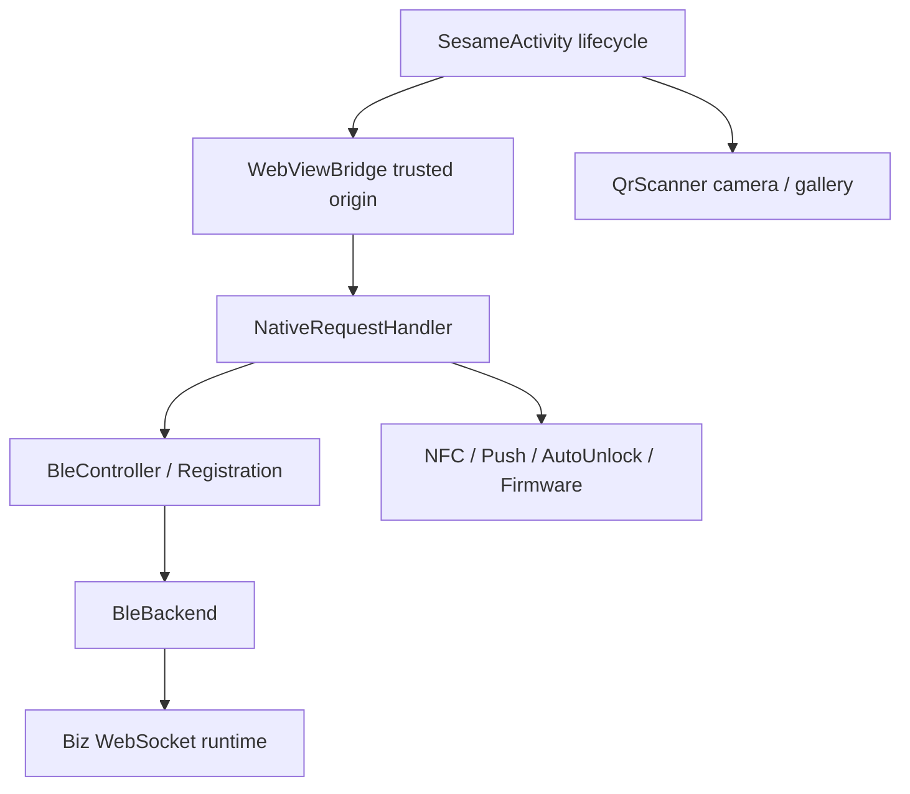
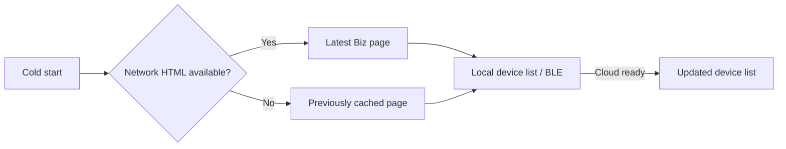

# SesameOS3 Android

[日本語](README.md) | [简体中文](README_zh-CN.md) | [English](README_en.md)

Android Web App 宿主与独立 Sesame BLE SDK。页面、账号和云端业务由 Biz3 实现；Android 提供 WebView、蓝牙及系统能力。


```mermaid
flowchart LR
  Biz[Biz3 React UI / Business] <-->|MessagePort| App[sesameApp Android]
  App --> SDK[sesameSdk BLE]
  SDK <--> Device[SESAME]
  App --> DB[(Room keys)]
  Biz <-->|WebSocket| AWS[Cloud services]
```

## 对外 SDK 接入

将 `sesameSdk` 集成到自己的 Android 应用即可使用蓝牙扫描、连接、注册、设备控制和状态回调，无需接入 Biz 或 Web App。界面、账号、服务端和数据存储由接入方选择。

Android Studio、JDK 17、Android SDK 36；minSdk 24。

### 1. 添加依赖

```groovy
dependencies {
    implementation project(':sesameSdk')
}
```

通过 JitPack 接入时，在 `settings.gradle` 中添加仓库：

```groovy
dependencyResolutionManagement {
    repositories {
        google()
        mavenCentral()
        maven { url 'https://jitpack.io' }
    }
}
```

然后在应用的 `build.gradle` 中添加 SDK 依赖：

```groovy
dependencies {
    implementation 'com.github.CANDY-HOUSE.SesameSDK_Android_with_DemoApp:sesameSdk:<version>'
}
```

将 `<version>` 替换为所需的发布标签。版本及模块坐标以 [JitPack 页面](https://jitpack.io/#CANDY-HOUSE/SesameSDK_Android_with_DemoApp) 展示的产物为准；版本标签见 [Releases](https://github.com/CANDY-HOUSE/SesameSDK_Android_with_DemoApp/releases)。

### 2. 权限

SDK Manifest 已声明蓝牙权限。宿主应按 Android 版本申请蓝牙扫描、连接所需的运行时权限；旧版 Android 扫描所需的定位权限由宿主配置。授权并开启蓝牙后再开始扫描。

### 3. 初始化

在 Application 初始化 `CHBleSupport` 和 `CHBleManager`。`backend` 实现 `CHBleHost`，提供注册、受限钥匙签名及设备数据回调；`keyStore` 实现 `CHKeyPersistence`，负责保存和删除钥匙；`gatewayTenantId` 是网关使用的租户标识。SDK 不限定服务端供应商、通信方式或数据库实现。接口定义见 [CHBleSupport.kt](sesameSdk/src/main/java/co/candyhouse/sesame/ble/CHBleSupport.kt)。

```kotlin
CHBleSupport.initialize(backend, keyStore, gatewayTenantId)
CHBleManager(applicationContext)
```

### 4. 扫描、连接和注册

通过扫描回调展示未注册设备；用户选定设备后连接，进入 `ReadyToRegister` 状态再注册。注册产生的钥匙由 `CHKeyPersistence` 保存。

```kotlin
import co.candyhouse.sesame.ble.*

CHBleManager.delegate = object : CHBleManagerDelegate {
    override fun didDiscoverUnRegisteredCHDevices(devices: List<CHDevices>) {
        // Display discovered devices for the user to select.
    }
}
CHBleManager.enableScan { result ->
    result.onFailure { /* Handle permission or Bluetooth errors. */ }
}

fun registerDevice(device: CHDevices) {
    var registering = false
    device.delegate = object : CHDeviceStatusDelegate {
        override fun onBleDeviceStatusChanged(device: CHDevices, status: CHDeviceStatus) {
            if (status == CHDeviceStatus.ReadyToRegister && !registering) {
                registering = true
                device.register { result ->
                    result.onSuccess { /* Registration completed. */ }
                    result.onFailure { /* Handle registration failure. */ }
                }
            }
        }
    }
    device.connect { result ->
        result.onFailure { /* Handle connection failure. */ }
    }
}
```

### 5. 恢复钥匙与蓝牙控制

从自己的持久化存储读取 `CHDevice`（下例 `savedKey`），用 `restoreDevice` 恢复设备，并设置 `CHDeviceStatusDelegate`（下例 `statusDelegate`）接收连接状态和机械状态。保持扫描开启，等待蓝牙鉴权完成后再发送控制命令。

```kotlin
val device = CHBleManager.restoreDevice(savedKey)
device?.delegate = statusDelegate
device?.connect { result ->
    result.onFailure { /* Handle connection failure. */ }
}

// After BLE authentication completes, for a CHSesame5-compatible device:
(device as? co.candyhouse.sesame.ble.os3.sesame5.CHSesame5)?.toggle { result ->
    result.onFailure { /* Handle command failure. */ }
}
```

按实际设备接口调用功能：锁可使用 `CHSesame5`，其他型号使用对应的 Bike、Bot、Biometric 或 Hub 接口。完整钥匙支持离线 BLE 操作；受限钥匙的鉴权需要签名服务。不再需要扫描时调用 `CHBleManager.disableScan`。

## 项目结构

| 模块 / 路径 | 说明 |
| --- | --- |
| `sesameApp` | Android 应用：WebView 宿主、蓝牙桥接和系统能力 |
| `sesameSdk` | 独立 BLE SDK：扫描、连接、注册、设备控制和状态通知 |
| `sesameSdk/src/main/java/co/candyhouse/sesame/ble` | 对外设备接口、产品型号与 BLE 管理入口 |
| `sesameSdk/src/main/java/co/candyhouse/sesame/ble/os3` | Sesame OS3 协议与设备实现 |
| `sesameApp/src/main/java/co/candyhouse/app/data` | 应用侧钥匙持久化 |
| `app.properties` | 应用共用配置与 Web App 环境地址 |

## OS3 设备架构


```mermaid
flowchart TB
    Devices[CHDevices]

    Devices --> Lock[CHSesameLock]
    Lock --> LockBase[CHSesameOS3LockBase]
    LockBase --> S5[CHSesame5Device]
    LockBase --> Bike2[CHSesameBike2Device]
    Bike2 --> Bike3[CHSesameBike3Device<br/>+ Fingerprint capability]
    LockBase --> Bot2[CHSesameBot2Device]

    Devices --> Connector[CHSesameConnector]
    Connector --> Bio[CHSesameBiometricDevice]
    Bio --> BioImpl[CHSesameBiometricDeviceImpl<br/>Capabilities by product profile]

    Devices --> Gateway[CHWifiModule2]
    Gateway --> Hub[CHHub3 / CHHub3Device]
```

### 当前维护产品

产品范围以 `CHProductModel` 为准，按实际 Device 实现分组：

| Device 实现 | 产品 |
| --- | --- |
| `CHSesame5Device` | Sesame 5、Sesame 5 Pro、Sesame 5 US、Sesame 6、Sesame 6 Pro、Sesame 6 Pro SlidingDoor、Sesame miwa、BLE Connector 1 |
| `CHSesameBike2Device` | Sesame Bike 2 |
| `CHSesameBike3Device` | Sesame Bike 3（组合指纹能力） |
| `CHSesameBot2Device` | Sesame Bot 2、Sesame Bot 3 |
| `CHSesameBiometricDeviceImpl` | Open Sensor 1/2、Remote、Remote Nano、Sesame Touch 1/1 Pro/2/2 Pro、Sesame Face 1/1 Pro/1 AI/1 Pro AI/2/2 Pro/2 AI/2 Pro AI |
| `CHHub3Device` | Hub 3、Hub 3 Pro |

> 不再维护：Sesame 3（`SS2`）、WiFi Module 2（`WM2`）、Sesame Bot 1、Sesame Bike 1、Sesame 4（`SS4`）。

### 生物识别能力

`CHSesameBiometricDeviceImpl` 通过产品 Profile 组合能力：

| 产品系列 | 能力 |
| --- | --- |
| Touch | 卡片、指纹 |
| Touch Pro | 卡片、指纹、密码 |
| Face | 卡片、指纹、掌纹、人脸 |
| Face Pro | 卡片、指纹、密码、掌纹、人脸 |
| Face AI | 掌纹、人脸 |
| Face Pro AI | 密码、掌纹、人脸 |

相关接口包括 `CHCardCapable`、`CHPassCodeCapable`、`CHFingerPrintCapable`、`CHPalmCapable`、`CHFaceCapable` 与 `CHRemoteNanoCapable`。

## 内部开发

项目共用配置保留在 `app.properties`，由根目录 `build.gradle` 读取，并随私有仓库管理。`local.properties` 仅用于 `sdk.dir` 等开发者本机配置，不提交 Git。Firebase 文件为 `sesameApp/google-services.json`，使用自己的项目配置。

```properties
aws.cognito.identityPoolId=<YOUR_IDENTITY_POOL_ID>
aws.cognito.userPoolId=<YOUR_USER_POOL_ID>
aws.cognito.appClientId=<YOUR_APP_CLIENT_ID>
google.maps.apiKey=<YOUR_MAPS_KEY>
candyhouse.sesame.web.dev=http://localhost:3000
candyhouse.sesame.web.prod=https://pre-app-h5.d36dwtby1bef9y.amplifyapp.com
```

Debug 页面地址由 `candyhouse.sesame.web.dev` 指定；Release/CI 页面地址由 `candyhouse.sesame.web.prod` 指定。APP 通过这些配置选择 Biz 预发或正式环境，与 Android 的分支名称无关。Biz 预发分支可独立发布；正式环境地址为 `https://biz.candyhouse.co`。修改 APP 页面地址后重新构建 Android。

```bash
# Biz3
cd ../Biz3
yarn install
yarn dev
# Android
adb reverse tcp:3000 tcp:3000
cd ../SesameOS3_Android
./gradlew :sesameApp:assembleDebug
```

## 职责分工


```mermaid
flowchart TB
  Activity[SesameActivity lifecycle] --> Bridge[WebViewBridge trusted origin]
  Activity --> QR[QrScanner camera / gallery]
  Bridge --> Handler[NativeRequestHandler]
  Handler --> BLE[BleController / Registration]
  Handler --> Platform[NFC / Push / AutoUnlock / Firmware]
  BLE --> Backend[BleBackend]
  Backend --> Biz[Biz WebSocket runtime]
```

Amplify Auth 保留用于旧登录会话衔接；core-kotlin 提供当前挂起 API。没有 Amplify API 插件。背景 WebView 复用 Biz 云端连接；NFC、通知、自动开锁、固件传输与扫码由各原生能力组件承接。

## 启动与离线


```mermaid
flowchart LR
  Start[Cold start] --> Page{Network HTML available?}
  Page -->|Yes| Online[Latest Biz page]
  Page -->|No| Cache[Previously cached page]
  Online --> Local[Local device list / BLE]
  Cache --> Local
  Local -->|Cloud ready| Cloud[Updated device list]
```

APK 不内置 Biz 页面。Service Worker 联网优先加载 HTML，并在资源成功缓存后保存离线入口；无网络使用已缓存页面。首次安装/首次切换域名/清除 WebView 数据后必须联网加载一次。页面缓存可能被系统清理，不能保证从未联网也能启动。

离线设备读取本地数据库，不等待 Cognito 或 WebSocket。名单只暴露名称、型号、UUID 和权限等级；钥匙留在原生。在线收到完整设备清单后更新可见范围，避免退出后恢复旧账号设备；未上传钥匙保留。受限钥匙仍需云端签名，无法承诺离线开锁；云端操作、注册和固件下载需要网络。

同 applicationId、兼容签名、允许的 versionCode 覆盖安装且不清数据时保留数据库和偏好。旧用户会话由 LegacySession 衔接，游客钥匙经 KeyHandoff 待同步。
