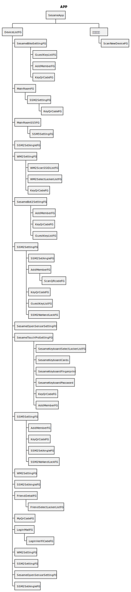

# App 画面のオブジェクトに関する説明  
**SesameApp:** Applicationの起動     
**MainActivity:** Main Activityの画面  
**ScanNewDeviceFG:** 新しいデバイスの追加    
**WM2SettingFG:** WIFI Module の設置画面    
**SSM2SetAngleFG:** SS4、SS2角度の設置画面   
**SSM5SettingFG:** SS5、SS5PROの設置画面    
**SSM2SettingFG:** SS4、SS2の設置画面   
**SesameBotSettingFG:** SesameBot1の設置画面    
**SesameBikeSettingFG:** BiKeLock1、BiKeLock2の設置画面  
**SesameKeyboardSettingFG:** Sesame5の設置画面    
**SesameOpenSensorNoBLESettingFG:** SSMOpenSensorの設置画面    
**SesameTouchProSettingFG:**  SSMTouchPro、SSMTouch、BLEConnector の設置画面    
**SesameKeyboardCards:** NFCカードの設置画面  
**SSMTouchProFingerprint:** 指紋の設置画面  
**SesameKeyboardPassCode:** 暗証番号の設置画面  
**SSMTouchProSelectLockerListFG:** SSMTouchProデバイスの共有画面  
**GuestKeyListFG:** ゲストのキーリスト画面  
**SSM2NoHandLockFG:** オートロックの画面  
**DeviceListFG:** ホームページ->Sesameリスト画面  
**MainRoomFG:** ホームページ->Sesameリスト画面->SS4、SS2デバイスの詳細と履歴  
**MainRoomSS5FG:** ホームページ->Sesameリスト画面->SS5、SS5PROデバイスの詳細と履歴     
**KeyQrCodeFG:** ホームページ->Sesameリスト画面->Sesameを共有するQRコード画面   
**WM2ScanSSIDListFG:** ホームページ->Sesameリスト画面->WIFIの詳細->WIFIのスキャンリスト画面  
**WM2SelectLockerListFG:** ホームページ->Sesameリスト画面->WIFIの詳細->Sesameデバイスを選択する画面
### フローチャート

