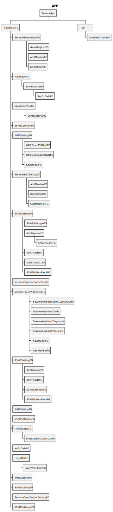

# アプリ インターフェース オブジェクトの説明
- **SesameApp:** アプリケーションプロセスの起動
- **MainActivity:** メインアプリケーション画面
- **ScanNewDeviceFG:** 新しいデバイスをスキャンして追加
- **WM2SettingFG:** WIFIモジュール設定画面
- **SSM2SetAngleFG:** SS4、SS2の角度設定画面
- **SSM5SettingFG:** SS5、SS5PROの設定画面
- **SSM2SettingFG:** SS4、SS2の設定画面
- **SesameBotSettingFG:** SesameBot1の設定画面
- **SesameBikeSettingFG:** BiKeLock1、BiKeLock2の設定画面
- **SesameKeyboardSettingFG:** Sesame5の設定画面
- **SesameOpenSensorNoBLESettingFG:** SSMOpenSensorの設定画面
- **SesameTouchProSettingFG:** SSMTouchPro、SSMTouch、BLEConnectorの設定画面
- **SesameKeyboardCards:** NFCカードの設定画面
- **SSMTouchProFingerprint:** 指紋の設定画面
- **SesameKeyboardPassCode:** 数字パスコードの設定画面
- **SSMTouchProSelectLockerListFG:** SSMTouchProデバイス共有画面
- **GuestKeyListFG:** ゲストキーリスト画面
- **SSM2NoHandLockFG:** 自動施錠画面

- **DeviceListFG:** ホームページ->Sesameリスト画面
- **MainRoomFG:** ホームページ->Sesameリスト画面->SS4、SS2デバイスの詳細と履歴
- **MainRoomSS5FG:** ホームページ->Sesameリスト画面->SS5、SS5PROデバイスの詳細と履歴
- **KeyQrCodeFG:** ホームページ->Sesameリスト画面->SesameシェアQRコード画面
- **WM2ScanSSIDListFG:** ホームページ->Sesameリスト画面->WIFI詳細->WIFIスキャンリスト画面
- **WM2SelectLockerListFG:** ホームページ->Sesameリスト画面->WIFI詳細->Sesameデバイス選択画面
### シーケンス図
