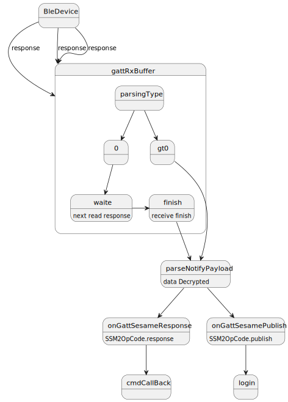

# Ble receive data
### onCharacteristicChanged Bleデータを受信する
```svg

  override fun onCharacteristicChanged(gatt: BluetoothGatt, characteristic: BluetoothGattCharacteristic) {
            super.onCharacteristicChanged(gatt, characteristic)
            val ssmSay = gattRxBuffer.feed(characteristic.value)
            val c=ssmSay?.first?:"null"
            L.l("onCharacteristicChanged",c.toString(),byToString(characteristic.value))
            if (ssmSay?.first == DeviceSegmentType.plain) {
                parseNotifyPayload(ssmSay.second)
            } else if (ssmSay?.first == DeviceSegmentType.cipher) {
                parseNotifyPayload(cipher!!.decrypt(ssmSay.second))
            }

        }
```
### SesameBleReceiverオブジェクトは、データコンテナを受信し、データが完全に転送されると、データ暗号化タイプとバイト配列を返す。
- buffer:データ保存
- segmentFlag:データが最初のものであるか、唯一のものであるかを判断する
- parsingType:データが終了したかを判断する
```svg
 internal class SesameBleReceiver {
        var buffer = byteArrayOf()
        internal fun feed(input: ByteArray): Pair<DeviceSegmentType, ByteArray>? {
        val segmentFlag = input[0]
        val isStartFlag = segmentFlag.toInt() and 1
        val parsingType = segmentFlag.toInt() shr 1
        //        L.d("hcia", "isStartFlag:" + isStartFlag)
        //        L.d("hcia", "parsingType:" + parsingType)
        if (isStartFlag > 0) {
        buffer = input.drop(1).toByteArray()
        } else {
        buffer += input.drop(1).toByteArray()
        }
        if (parsingType > 0) {
        val buf = buffer
        buffer = byteArrayOf()
        val type = DeviceSegmentType.getByValue(parsingType)
        return Pair(type, buf)
        } else {
        return null
        }
        }
        }

```
### parseNotifyPayload 関数は主に、データがレスポンスデータであるか、BLEからプッシュされたデータであるかを判断する。
- palntext:復号化データ

```svg

  private fun parseNotifyPayload(palntext: ByteArray) {
            L.l("parse data  rx",byToString(palntext))
            val ssm2notify = SesameNotifypayload(palntext)
//            L.d("hcia", "[ss5] ssm2notify.notifyOpCode:" + ssm2notify.notifyOpCode)
            if (ssm2notify.notifyOpCode == SSM2OpCode.response) {
                onGattSesameResponse(SSM3ResponsePayload(ssm2notify.payload))
            } else if (ssm2notify.notifyOpCode == SSM2OpCode.publish) {
                onGattSesamePublish(SSM3PublishPayload(ssm2notify.payload))
            }
        }
```
### onGattSesameResponse Bleデータ受信処理
- cmdCallBack:Mapオブジェクト、送信データの応答と受信データの処理を行う
```
   private fun onGattSesameResponse(ssm2ResponsePayload: SSM3ResponsePayload) {
            cmdCallBack.get(ssm2ResponsePayload.cmdItCode)?.invoke(ssm2ResponsePayload)
            cmdCallBack.remove(ssm2ResponsePayload.cmdItCode)
//            L.d("hcia", "[ss5] 🀄Command: <==:" + (ssm2ResponsePayload.cmdItCode) + " " + (ssm2ResponsePayload.cmdResultCode))
        }
```
### フローチャート
