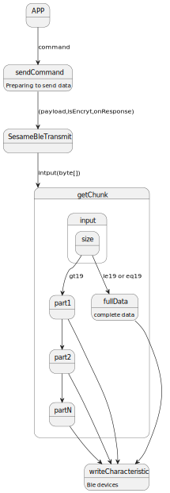

# Ble send data 
### 函数 sendCommand 封装BLE数据传输
- payload:准备传递的信息
- isEncryt:是否加密
- onResponse:回调响应
```svg
fun sendCommand(payload: SesameOS3Payload, isEncryt: DeviceSegmentType = DeviceSegmentType.cipher, onResponse: SesameOS3ResponseCallback) {
        val tmp = cmdCallBack[payload.itemCode]
        cmdCallBack[payload.itemCode] = onResponse
        if (tmp != null) {
              return
        }
        val  isChipher=if (isEncryt == DeviceSegmentType.cipher) "cipher" else "no cipher"
        L.l("parse data send",payload.itemCode.toString(),isChipher,byToString(payload.toDataWithHeader()),payload.toDataWithHeader().toHexString())
        CoroutineScope(IO).launch {
            semaphore.acquire()
            val say2ssm = if (isEncryt == DeviceSegmentType.cipher) {
                cipher?.encrypt(payload.toDataWithHeader())
            } else {
                payload.toDataWithHeader()
            }
            gattTxBuffer = SesameBleTransmit(isEncryt, say2ssm!!)
            transmit()
        }

```
### 枚举 DeviceSegmentType 判断传输接受数据是否存在加密
-  plain(1) : 数据没有加密
-  cipher(2)  : 数据存在加密
### 函数 SesameBleTransmit 主要对bytes做数据分割 最大传输字节长度20
- type:DeviceSegmentType类型
- input:发送给ble设备字节数组
- isStart:标记数据是否已传输完成，完成返回-1
```代码示例
  
internal class SesameBleTransmit(var type: DeviceSegmentType, var input: ByteArray) {
    var isStart = 1
    internal fun getChunk(): ByteArray? {
        if (isStart == -1) {

            return null
        } else if (input.size <= 19) {
            val segmentHeader = ((type.value shl 1) or isStart).toByte()
            isStart = -1
            return byteArrayOf(segmentHeader) + input
        } else {
            val payload = input.copyOf(19)
            val segmentHeader = isStart.toByte()
            input = input.drop(19).toByteArray()
            isStart = 0
            return byteArrayOf(segmentHeader) + payload
        }
    }
}

```
### 函数 transmit 写入ble数据，最大20字节
- semaphore:限制并发访问
```svg
  fun transmit() {
        mCharacteristic?.value = gattTxBuffer?.getChunk()
        if (mCharacteristic?.value == null) {
            semaphore.release()
            return
        }
        val check = mBluetoothGatt?.writeCharacteristic(mCharacteristic)
//        L.d("hcia", "[ss5][app][say]:" + mCharacteristic?.value?.toHexString() + " check:" + check)
        if (check == false) {
            semaphore.release()
            disconnect { }
        }
    }
```
### 循环图
