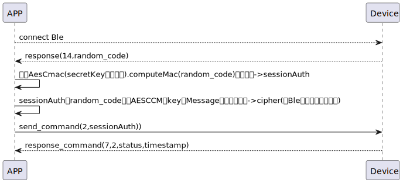

# login ログインに関する説明

### 送信フォーマット

|  Byte  |     4~1     |        0 |
|:------:|:-----------:|---------:|
| Data   | ccmkey 	 |  command |

- ccmkey :[RandomCode](RandomCode.md)による取得する
- command:命令2(固定)


### 受信フォーマット
| Byte |6~3| 2 | 1 | 0 |  
|-------|:------:|:------:|:------:|:------:|
| Data | timestamp|status | command | response  |
- command:命令2(固定)
- response:応答0x07(固定)
- status:状態0x00(成功) 
- timestamp:タイムスタンプ
### フローチャート



### android例
``` java
     override fun login(token: String?) {
        deviceStatus = CHDeviceStatus.BleLogining
        val sessionAuth: ByteArray? = AesCmac(sesame2KeyData!!.secretKey.hexStringToByteArray(), 16).computeMac(mSesameToken)

        cipher = SesameOS3BleCipher("customDeviceName", sessionAuth!!, ("00" + mSesameToken.toHexString()).hexStringToByteArray())
        sendCommand(SesameOS3Payload(SesameItemCode.login.value, sessionAuth!!.sliceArray(0..3)), DeviceSegmentType.plain) { loginPayload ->
            val systemTime = loginPayload.payload.sliceArray(0..3).toBigLong()
            val currentTimestamp = System.currentTimeMillis() / 1000
            val timeMinus = currentTimestamp.minus(systemTime)

            if (PreferenceManager.getDefaultSharedPreferences(CHBleManager.appContext).getString("nickname", "")?.contains(BuildConfig.testname) == true) {
                deviceTimestamp = systemTime
                loginTimestamp = currentTimestamp
            } else {
                if (abs(timeMinus) > 3) {
                    sendCommand(SesameOS3Payload(SesameItemCode.time.value, System.currentTimeMillis().toUInt32ByteArray()), DeviceSegmentType.cipher) {}
                }
            }
        }
    }
```
