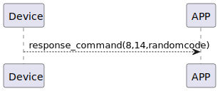

# RandomCode ランダムコードの取得に関する説明
スマートフォンがBleデバイスに接続し、nofityを開始すると、Bleデバイスは4Bytes random code4を返します。
#### スマートフォンがデバイスに接続し、notifyを開始すると、デバイスは4桁のランダムコードを返します。

## 受信フォーマット
| Byte |    5~2     | 1 | 0 |
|:----:|:----------:|:----:|:----:|
| Data | randomcode | command | response  |
- command:命令14(固定)
- response:応答0x08(固定)
- randomcode:ランダムcode

## フローチャート



## android例
``` java
    override fun onGattSesamePublish(receivePayload: SSM3PublishPayload) {
        if (receivePayload.cmdItCode == SesameItemCode.initial.value) {
            mSesameToken = receivePayload.payload
            L.d("hcia", "isNeedAuthFromServer:" + isNeedAuthFromServer)
            if (isRegistered) {
                if (isNeedAuthFromServer == true) {
                    CHAccountManager.signGuestKey(CHRemoveSignKeyRequest(deviceId.toString().uppercase(), mSesameToken.toHexString(), sesame2KeyData!!.secretKey)) {
                        it.onSuccess {
                            (this as CHDeviceUtil).login(it.data)
                        }
                    }
                } else {
                    (this as CHDeviceUtil).login()
                }
            } else {
                deviceStatus = CHDeviceStatus.ReadyToRegister
            }
        }
    }

```
