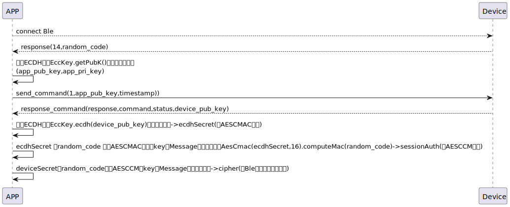

# register 登録接続

### 送信フォーマット


|  Byte  | 68~65|        4~1 |       0 |  
|:------:|:----:|-----------:|--------:|
| Data   |timestamp|  publicKeyA | command |

- command:指令1(固定)
- timestamp:手機の現在のタイムスタンプ
- publicKeyA: 楕円曲線（Elliptic Curve，EC）鍵対生成アルゴリズムによって生成されたもので、非対称暗号アルゴリズムに属します
```agsl

 internal fun getDeviceECCKey(): KeyPair {
        keyPairA?.let { return it }
        val keyGen = KeyPairGenerator.getInstance("EC")
        keyGen.initialize(ECGenParameterSpec("secp256r1")) //prime256v1 == secp256r1 == NIST P-256
        val newKeyPairA = keyGen.generateKeyPair()
        keyPairA = newKeyPairA
        return newKeyPairA
    }
```

### 受信フォーマット


| Byte  |79~16|15~10 |9~3|    2 |   1   |     0      |  
|:---:|:----:|:----:|:-----:|:----:|:-----:|:-----:|
| Data | publicKeyS|mechSetting|mechStatus| status  | command |response   |
- command:コマンド1(固定)
- response:応答0x07(固定)

- status:ステータス0x00（成功） ステータス0x09（既に登録済み）は[login](login.md)プロセスに移行
- mechSetting:デバイスのロックとアンロックの設定
- mechStatus: デバイスの現在の各種情報の状態
- publicKeyS:デバイスの公開鍵

### シーケンス図




### android示例
``` java
       override fun register(result: CHResult<CHEmpty>) {
        if (deviceStatus != CHDeviceStatus.ReadyToRegister) {
            result.invoke(Result.failure(NSError("Busy", "CBCentralManager", 7)))
            return
        }
        deviceStatus = CHDeviceStatus.Registering

        L.d("hcia", "register:!!")
        makeApiCall(result) {
            val serverSecret = mSesameToken.toHexString()
            sendCommand(SesameOS3Payload(SesameItemCode.registration.value, EccKey.getPubK().hexStringToByteArray() + System.currentTimeMillis().toUInt32ByteArray()), DeviceSegmentType.plain) { IRRes ->
                mechStatus = CHSesame5MechStatus(IRRes.payload.toHexString().hexStringToByteArray().sliceArray(0..6))
                mechSetting = CHSesame5MechSettings(IRRes.payload.toHexString().hexStringToByteArray().sliceArray(7..12))

                val eccPublicKeyFromSS5 = IRRes.payload.toHexString().hexStringToByteArray().sliceArray(13..76)
                val ecdhSecret = EccKey.ecdh(eccPublicKeyFromSS5)
                val ecdhSecretPre16 = ecdhSecret.sliceArray(0..15)
                val deviceSecret = ecdhSecretPre16.toHexString()
                val candyDevice = CHDevice(deviceId.toString(), advertisement!!.productModel!!.deviceModel(), null, "0000", deviceSecret, serverSecret)
                sesame2KeyData = candyDevice

                val sessionAuth = AesCmac(ecdhSecretPre16, 16).computeMac(mSesameToken)

                cipher = SesameOS3BleCipher("customDeviceName", sessionAuth!!, ("00" + mSesameToken.toHexString()).hexStringToByteArray())
                CHDB.CHSS2Model.insert(candyDevice) {
                    result.invoke(Result.success(CHResultState.CHResultStateBLE(CHEmpty())))
                }

                deviceStatus = if (mechStatus?.isInLockRange == true) CHDeviceStatus.Locked else CHDeviceStatus.Unlocked

            }
        }
    }
```
