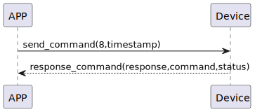

# タイムスタンプの更新

### 送信フォーマット

|  Byte  | 4~1|       0 |  
|:------:|:----:|--------:|
| Data   | timestamp| command |

- command: コマンド8（固定）
- timestamp: 携帯電話の現在のタイムスタンプ


### 受信フォーマット

| Byte  |    2    |   1   |     0      |  
|:---:|:-------:|:-----:|:---------:|
| Data | status  | command |response   |
- command: コマンド8（固定）
- response: 応答0x07（固定）
- status: ステータス0x00（成功）

### シーケンス図


### Androidの例
```java
        override fun updateTime(result: CHResult<CHEmpty>) {
        if (checkBle(result)) return
        sendCommand(SesameOS3Payload(SesameItemCode.time.value, System.currentTimeMillis().toUInt32ByteArray()), DeviceSegmentType.cipher) { res ->
            result.invoke(Result.success(CHResultState.CHResultStateBLE(CHEmpty())))
        }
    }


### android示例
``` java
        override fun updateTime(result: CHResult<CHEmpty>) {
        if (checkBle(result)) return
        sendCommand(SesameOS3Payload(SesameItemCode.time.value, System.currentTimeMillis().toUInt32ByteArray()), DeviceSegmentType.cipher) { res ->
            result.invoke(Result.success(CHResultState.CHResultStateBLE(CHEmpty())))
        }
    }
```
