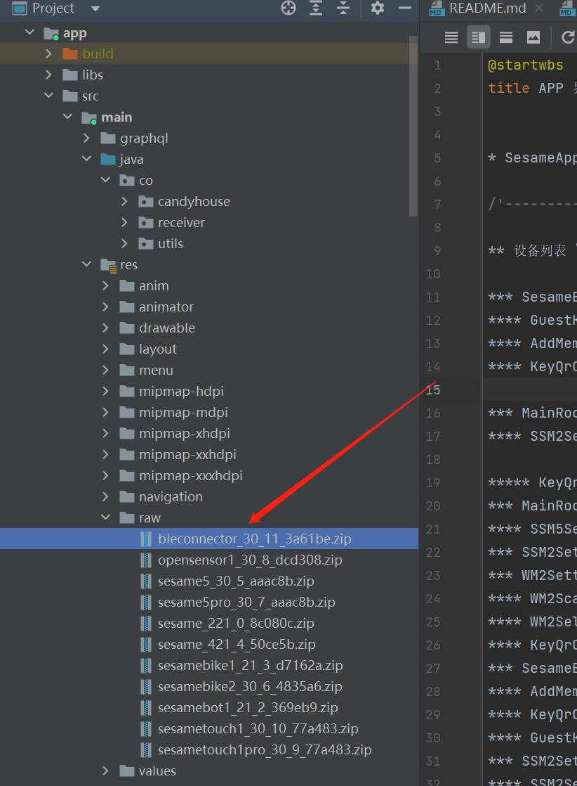

SesameOs3 ファームウェアのアップグレード
=======================
1. APPとデバイスの接続が正常であることを確認してください。
2. ファームウェアのパス [app/src/main/res/raw](../../app/src/main/res/raw)，
ファームウェアの位置は以下の通りです。
   
3. ファームウェアオブジェクト **CHProductModel**
4. フレームワークを選択します [Dfu](https://github.com/NordicSemiconductor/Android-DFU-Library)
5. コード例の位置[BaseDeviceSettingFG](../../app/src/main/java/co/candyhouse/app/base)
  ,以下のように、deviceAddressを取得し、DfuServiceInitiatorに書込みます。
```
val starter = DfuServiceInitiator(it.data.address)
starter.setZip(targetDevice.getFirZip())
starter.setPacketsReceiptNotificationsEnabled(true)
starter.setPrepareDataObjectDelay(400)
starter.setUnsafeExperimentalButtonlessServiceInSecureDfuEnabled(true)
starter.setDisableNotification(false)
starter.setForeground(false)
starter.start(requireActivity(), DfuService::class.java)
```

