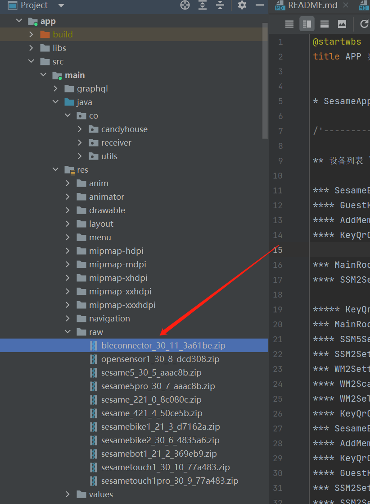

SesameOs3 ファームウェアアップデート
=======================
1. アプリとデバイスが正常に接続されていることを確認します。
2. ファームウェアのパス [app/src/main/res/raw](../../app/src/main/res/raw)，
   ファームウェアの場所は以下の画像の通りです:
   
3. ファームウェアオブジェクト **CHProductModel**
4. フレームワークの選択 [Dfu](https://github.com/NordicSemiconductor/Android-DFU-Library)
5. サンプルコードの場所 [BaseDeviceSettingFG](../../app/src/main/java/co/candyhouse/app/base)
   , deviceAddress を DfuServiceInitiator に渡す例は以下の通りです:
```
val starter = DfuServiceInitiator(it.data.address)
starter.setZip(targetDevice.getFirZip())
starter.setPacketsReceiptNotificationsEnabled(true)
starter.setPrepareDataObjectDelay(400)
starter.setUnsafeExperimentalButtonlessServiceInSecureDfuEnabled(true)
starter.setDisableNotification(false)
starter.setForeground(false)
starter.start(requireActivity(), DfuService::class.java)
```

