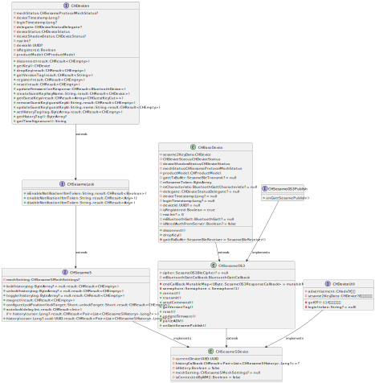

 
# CHSesame5Device クラス
```svg
internal class CHSesame5Device : CHSesameOS3(), CHSesame5, CHDeviceUtil {
    private var currentDeviceUUID: UUID? = null
    private var historyCallback: CHResult<Pair<List<CHSesame5History>, Long?>>? = null
    var isHistory: Boolean = false
      

    override var mechSetting: CHSesame5MechSettings? = null
    override var advertisement: CHadv? = null
     
    var isConnectedByWM2: Boolean = false

    override fun goIOT() {
        // Implementation
    }

    override fun configureLockPosition(lockTarget: Short, unlockTarget: Short, result: CHResult<CHEmpty>) {
        // Implementation
    }

    override fun autolock(delay: Int, result: CHResult<Int>) {
        // Implementation
    }

    override fun magnet(result: CHResult<CHEmpty>) {
        // Implementation
    }

    private fun eventToHistory(historyType: Sesame2HistoryTypeEnum?, ts: Long, recordID: Int, mechStatus: CHSesame5MechStatus?, histag: ByteArray?): CHSesame5History? {
        // Implementation
    }

    override fun history(cursor: Long?, uuid: UUID, result: CHResult<Pair<List<CHSesame5History>, Long?>>) {
        // Implementation
    }

    override fun toggle(historytag: ByteArray?, result: CHResult<CHEmpty>) {
        // Implementation
    }

    override fun unlock(historytag: ByteArray?, result: CHResult<CHEmpty>) {
        // Implementation
    }

    override fun lock(historytag: ByteArray?, result: CHResult<CHEmpty>) {
        // Implementation
    }

    override fun register(result: CHResult<CHEmpty>) {
        // Implementation
    }

    override fun login(token: String?) {
        // Implementation
    }

    private fun readHistoryCommand() {
        // Implementation
    }

    override fun onGattSesamePublish(receivePayload: SSM3PublishPayload) {
        // Implementation
    }
}


```
`CHSesame5Device`クラスは、`CHSesameOS3`クラスを継承し、`CHSesame5`と`CHDeviceUtil`インタフェースを実装しています。Sesame 5デバイスを代表しているものと予想されます。

## プロパティ

- `currentDeviceUUID`：デバイスのUUID
- `historyCallback`：履歴のコールバック関数
- `isHistory`：履歴があるかどうかをチェックするブール変数
- `mechSetting`：デバイス機械の設置
- `advertisement`：デバイスのアドバタイジングデータ
- `isConnectedByWM2`：WM2に接続しているかどうかをチェックするブール変数

## メソッド

- `goIOT`：IoT操作を処理する関数
- `configureLockPosition`：ロックの位置を設定する関数
- `autolock`：自動的にロックを施錠する関数
- `magnet`：磁性処理を行う関数
- `eventToHistory`：イベントを履歴記録に変換する関数
- `history`：履歴を取得する関数
- `toggle`：デバイス状態を切替える関数
- `unlock`：デバイスのロックを解除する関数
- `lock`：デバイスをロックする関数
- `register`：デバイスを登録する関数
- `login`：デバイスをログインする関数
- `readHistoryCommand`：履歴コマンドを読取る関数
- `onGattSesamePublish`：GATT Sesameの通知を処理する関数


  