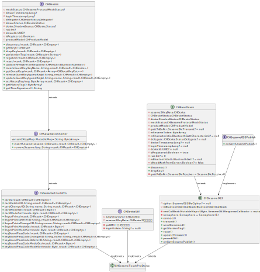

# CHSesameTouchProDevice

## 属性
```svg
internal class CHSesameTouchProDevice : CHSesameOS3(), CHSesameTouchPro, CHDeviceUtil {

    ssm2KeysMap: MutableMap<String, ByteArray> = mutableMapOf()
    advertisement: CHadv? = null
    keyBoardPassCodeModeGet(result: CHResult<Byte>)
    keyBoardPassCodeModeSet(mode: Byte, result: CHResult<CHEmpty>)
    keyBoardPassCodeDelete(ID: String, result: CHResult<CHEmpty>)
    keyBoardPassCode(result: CHResult<CHEmpty>)
    keyBoardPassCodeChange(ID: String, name: String, result: CHResult<CHEmpty>)
    fingerPrintModeGet(result: CHResult<Byte>)
    fingerPrintModeSet(mode: Byte, result: CHResult<CHEmpty>)
    fingerPrintDelete(ID: String, result: CHResult<CHEmpty>)
    fingerPrints(result: CHResult<CHEmpty>)
    fingerPrintsChange(ID: String, name: String, result: CHResult<CHEmpty>)
    cardModeGet(result: CHResult<Byte>)
    cardModeSet(mode: Byte, result: CHResult<CHEmpty>)
    cardDelete(ID: String, result: CHResult<CHEmpty>)
    cardChange(ID: String, name: String, result: CHResult<CHEmpty>)
    cards(result: CHResult<CHEmpty>)
    login(token: String?)
    register(result: CHResult<CHEmpty>)
    insertSesame(sesame: CHDevices, result: CHResult<CHEmpty>)
    removeSesame(tag: String, result: CHResult<CHEmpty>)
    onGattSesamePublish(receivePayload: SSM3PublishPayload)
                                                                    
}                                                                    


```
- `ssm2KeysMap`：存储 SSM2 密钥。
- `advertisement`：设备广播。

## 方法

- `keyBoardPassCodeModeGet(result: CHResult<Byte>)`：从设备获取密码模式。
- `keyBoardPassCodeModeSet(mode: Byte, result: CHResult<CHEmpty>)`：设置设备的密码模式。
- `keyBoardPassCodeDelete(ID: String, result: CHResult<CHEmpty>)`：从设备删除密码。
- `keyBoardPassCodeChange(ID: String, name: String, result: CHResult<CHEmpty>)`：更改设备的密码。
- `fingerPrintModeGet(result: CHResult<Byte>)`：从设备获取指纹模式。
- `fingerPrintModeSet(mode: Byte, result: CHResult<CHEmpty>)`：设置设备的指纹模式。
- `fingerPrintDelete(ID: String, result: CHResult<CHEmpty>)`：从设备删除指纹。
- `fingerPrintsChange(ID: String, name: String, result: CHResult<CHEmpty>)`：更改设备的指纹。
- `cardModeGet(result: CHResult<Byte>)`：从设备获取卡片模式。
- `cardModeSet(mode: Byte, result: CHResult<CHEmpty>)`：设置设备的卡片模式。
- `cardDelete(ID: String, result: CHResult<CHEmpty>)`：从设备删除卡片。
- `cardChange(ID: String, name: String, result: CHResult<CHEmpty>)`：更改设备的卡片。
- `login(token: String?)`：登录设备。
- `register(result: CHResult<CHEmpty>)`：注册设备。
- `insertSesame(sesame: CHDevices, result: CHResult<CHEmpty>)`：插入 Sesame 设备。
- `removeSesame(tag: String, result: CHResult<CHEmpty>)`：移除 Sesame 设备。
- `onGattSesamePublish(receivePayload: SSM3PublishPayload)`：处理设备发布事件。

## 继承

- `CHSesameOS3`
- `CHSesameTouchPro`
- `CHDeviceUtil`

