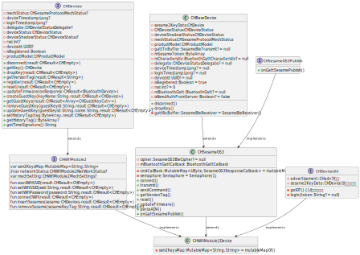

# CHWifiModule2Device
```svg
internal class CHWifiModule2Device : CHSesameOS3(), CHWifiModule2, CHDeviceUtil {

    // Properties
    override var ssm2KeysMap: MutableMap<String, String> = mutableMapOf()
    override var mechSetting: CHWifiModule2MechSettings? = CHWifiModule2MechSettings(null, null)
      


    override var advertisement: CHadv? = null
      

    override fun connect(result: CHResult<CHEmpty>) {
      
    }

    override fun register(result: CHResult<CHEmpty>) {
       
    }

    override fun login(token: String?) {
    }

    override fun scanWifiSSID(result: CHResult<CHEmpty>) {
    }

    override fun setWifiSSID(ssid: String, result: CHResult<CHEmpty>) {
    }

    override fun setWifiPassword(password: String, result: CHResult<CHEmpty>) {
    }

    override fun connectWifi(result: CHResult<CHEmpty>) {
    }

    override fun insertSesames(sesame: CHDevices, result: CHResult<CHEmpty>) {
    }

    override fun removeSesame(sesameKeyTag: String, result: CHResult<CHEmpty>) {
    }

    override fun getVersionTag(result: CHResult<String>) {
    }

    override fun reset(result: CHResult<CHEmpty>) {
    }

    override fun updateFirmware(onResponse: CHResult<BluetoothDevice>) {
    }

  
    val mBluetoothGattCallback: BluetoothGattCallback = object : BluetoothGattCallback()
  
    private fun onGattWM2Publish(receivePayload: SSM3PublishPayload) {
    }
}

```
`CHWifiModule2Device` は内部のクラスです。 `CHSesameOS3`を継承し、`CHWifiModule2`と `CHDeviceUtil` インターフェースを実装してます。主にWi-Fiモジュール2のデバイスに関連する操作を処理します。

## プロパティ

- `ssm2KeysMap`：`MutableMap`は、キーと値のペアを保存するために使用される変更可能なマップです。一个`MutableMap`，用于存储键值对。
- `mechSetting`：`CHWifiModule2MechSettings`オブジェクトで、機械設定を設置します。
- `advertisement`：`CHadv`オブジェクトで、advertisement用です。

## メソッド

- `connect(result: CHResult<CHEmpty>)`：接続方法です。
- `register(result: CHResult<CHEmpty>)`：登録方法です。
- `login(token: String?)`：ログインする方法です。
- `scanWifiSSID(result: CHResult<CHEmpty>)`：Wi-Fi SSIDをスキャンする方法です。
- `setWifiSSID(ssid: String, result: CHResult<CHEmpty>)`：Wi-Fi SSIDを設置する方法です。
- `setWifiPassword(password: String, result: CHResult<CHEmpty>)`：Wi-Fiのパスワードを設置する方法です。
- `connectWifi(result: CHResult<CHEmpty>)`：Wi-Fiに接続する方法です。
- `insertSesames(sesame: CHDevices, result: CHResult<CHEmpty>)`：sesamesを挿入する方法です。
- `removeSesame(sesameKeyTag: String, result: CHResult<CHEmpty>)`：sesameを削除する方法です。
- `getVersionTag(result: CHResult<String>)`：バージョンタグを取得する方法です。
- `reset(result: CHResult<CHEmpty>)`：リセットする方法です。
- `updateFirmware(onResponse: CHResult<BluetoothDevice>)`：ファームウェアを更新する方法です。
- `mBluetoothGattCallback`：`BluetoothGattCallback`オブジェクトで、Bluetooth GATTのコールバックを処理します。
- `onGattWM2Publish(receivePayload: SSM3PublishPayload)`：GATT WM2の発行を処理する方法です。





