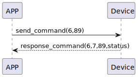

# AutoLock　オートロック

### 送信フォーマット
| Byte | 2 ~ 1 | 0 |
|:----:|:-----:|:------:|
| Data | delay_duration|  command |
- command:命令11(固定)
- delay_duration:遅延時間(s) 0オートロックを無効にする

## 受信フォーマット
| Byte | 2 | 1 | 0 |
|:----:|:----:|:----:|:----:|
| Data | status | command | response  |
- response:応答0x07(固定)
- command:命令11(固定)
- status:状態0x00(成功) 
## フローチャート



## android例
``` java
    override fun autolock(delay: Int, result: CHResult<Int>) {
        if (checkBle(result)) return
        sendCommand(SesameOS3Payload(SesameItemCode.autolock.value, delay.toShort().toReverseBytes()), DeviceSegmentType.cipher) { res ->
            mechSetting?.autoLockSecond = delay.toShort()
            result.invoke(Result.success(CHResultState.CHResultStateBLE(delay)))
        }
    }
```
