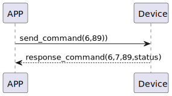

# Click 点击复原

### 发送格式
| Byte |    1    |0|
|:----:|:-------:|:-------:|
| Data |  command |opcode|
- command:指令89(固定)
- payload:传输data
- opcode:值为6。详情参考[opcode](../class/SSM2OpCode.md)
## 接收格式
| Byte | 3|    2    | 1 |   0   |  
|:----:|:----:|:-------:|:----:|:-----:|
| Data | status | command | response  |opcode |
- response:响应0x07(固定)
- command:指令89(固定)
- status:状态0x00(成功)
- opcode:值为6。详情参考[opcode](../class/SSM2OpCode.md)
## 循序图



## android示例
``` java
    override fun click(historyTag: ByteArray?, result: CHResult<CHEmpty>) {

//        L.d("hcia", "click deviceStatus.value:" + deviceStatus.value)
//        L.d("hcia", "isConnectedByWM2:" + isConnectedByWM2)
        if (deviceStatus.value == CHDeviceLoginStatus.UnLogin && isConnectedByWM2) {
            CHAccountManager.cmdSesame(SesameItemCode.click, this, sesame2KeyData!!.hisTagC(historyTag), result)

        }
        if (checkBle(result)) return

//        L.d("hcia", "🎃 historyTag:" + " " + sesame2KeyData!!.historyTag?.let { String(it) } + " " + sesame2KeyData!!.historyTag)
        val his = sesame2KeyData!!.createHistag(historyTag)
        sendEncryptCommand(SSM2Payload(SSM2OpCode.async, SesameItemCode.click, his)) { res ->
            if (res.cmdResultCode == SesameResultCode.success.value) {
                result.invoke(Result.success(CHResultState.CHResultStateBLE(CHEmpty())))
            } else {
                result.invoke(Result.failure(NSError(res.cmdResultCode.toString(), "CBCentralManager", res.cmdResultCode.toInt())))
            }
        }
    }
```
