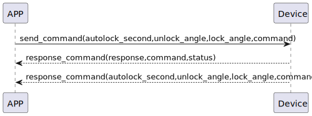

# configureLockPosition ロックのスイッチ状態とロックの位置を取得します

### 送信フォーマット

|  Byte  |      6~-5|    4~3     |2~1       |  0 |
|:------:|:---------------:|:----------:|:----:|:----:|
| Data   | autolock_second | unlock_angle |lock_angle|command|

- command:指令80(固定)
- autolock_second:自动关锁时间
- unlock_angle:开锁角度
- lock_angle:关锁角度
### 受信フォーマット

| Byte |    2    |   1   | 0 |  
|:----:|:-------:|:-----:|:---:|
| Data | status  | command | response  |
- response:応答0x07(固定)
- command:命令80(固定)
- status:状態0x00(成功)
### device->app プッシュ通知の設定
|  Byte  |      6~-5|    4~3     |2~1       |  0 |
|:------:|:---------------:|:----------:|:----:|:----:|
| Data   | autolock_second | lock_angle |lock|command|

- 送信フォーマットと一致する 
### フローチャート


### android例
``` java
       override fun configureLockPosition(lockTarget: Short, unlockTarget: Short, result: CHResult<CHEmpty>) {
        val cmd = SesameOS3Payload(SesameItemCode.mechSetting.value, lockTarget.toReverseBytes() + unlockTarget.toReverseBytes())
        sendCommand(cmd, DeviceSegmentType.cipher) { res ->
            if (res.cmdResultCode == SesameResultCode.success.value) {
                mechSetting?.lockPosition = lockTarget
                mechSetting?.unlockPosition = unlockTarget
                result.invoke(Result.success(CHResultState.CHResultStateBLE(CHEmpty())))
            } else {
                result.invoke(Result.failure(NSError(res.cmdResultCode.toString(), "CBCentralManager", res.cmdResultCode.toInt())))
            }
        }
    }
    
        override fun onGattSesamePublish(receivePayload: SSM3PublishPayload) {
        super.onGattSesamePublish(receivePayload)
//        L.d("hcia", "[ss5] " + receivePayload.cmdItCode)
        if (receivePayload.cmdItCode == SesameItemCode.mechStatus.value) {
            mechStatus = CHSesame5MechStatus(receivePayload.payload)
            deviceStatus = if (mechStatus!!.isInLockRange) CHDeviceStatus.Locked else CHDeviceStatus.Unlocked
            readHistoryCommand()
        }
        if (receivePayload.cmdItCode == SesameItemCode.mechSetting.value) {
            mechSetting = CHSesame5MechSettings(receivePayload.payload)
        }
    } 
    
    class CHSesame5MechSettings(data: ByteArray) {
    var lockPosition: Short = bytesToShort(data[0], data[1])
    var unlockPosition: Short = bytesToShort(data[2], data[3])
    var autoLockSecond: Short = bytesToShort(data[4], data[5])
}
```
