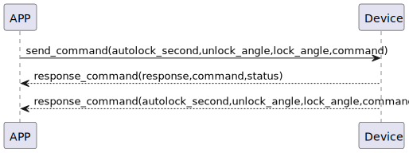

# configureLockPosition 获取锁开关和配置锁位置

### 送信フォーマット
| バイト | 6〜5 | 4〜3 | 2〜1 | 0 |
|:----:|:---------------:|:----------:|:----:|:----:|
| データ | 自動ロック秒数 | ロックアングル | 開錠アングル | コマンド |

- コマンド: 指令80（固定）
- 自動ロック秒数: 自動ロック時間
- ロックアングル: ロック位置の角度
- 開錠アングル: 開錠位置の角度

### 受信フォーマット
| バイト | 2 | 1 | 0 |
|:----:|:----:|:----:|:----:|
| データ | ステータス | コマンド | レスポンス |
- レスポンス: 応答0x07（固定）
- コマンド: 指令80（固定）
- ステータス: 状態0x00（成功）

### device->app 推送設定
| バイト | 6〜5 | 4〜3 | 2〜1 | 0 |
|:----:|:---------------:|:----------:|:----:|:----:|
| データ | 自動ロック秒数 | ロックアングル | ロック | コマンド |

- 送信フォーマットと同じ

### シーケンス図


### Androidの例
``` java
       override fun configureLockPosition(lockTarget: Short, unlockTarget: Short, result: CHResult<CHEmpty>) {
        val cmd = SesameOS3Payload(SesameItemCode.mechSetting.value, lockTarget.toReverseBytes() + unlockTarget.toReverseBytes())
        sendCommand(cmd, DeviceSegmentType.cipher) { res ->
            if (res.cmdResultCode == SesameResultCode.success.value) {
                mechSetting?.lockPosition = lockTarget
                mechSetting?.unlockPosition = unlockTarget
                result.invoke(Result.success(CHResultState.CHResultStateBLE(CHEmpty())))
            } else {
                result.invoke(Result.failure(NSError(res.cmdResultCode.toString(), "CBCentralManager", res.cmdResultCode.toInt())))
            }
        }
    }
    
    override fun onGattSesamePublish(receivePayload: SSM3PublishPayload) {
        super.onGattSesamePublish(receivePayload)
//        L.d("hcia", "[ss5] " + receivePayload.cmdItCode)
        if (receivePayload.cmdItCode == SesameItemCode.mechStatus.value) {
            mechStatus = CHSesame5MechStatus(receivePayload.payload)
            deviceStatus = if (mechStatus!!.isInLockRange) CHDeviceStatus.Locked else CHDeviceStatus.Unlocked
            readHistoryCommand()
        }
        if (receivePayload.cmdItCode == SesameItemCode.mechSetting.value) {
            mechSetting = CHSesame5MechSettings(receivePayload.payload)
        }
    } 
    
    class CHSesame5MechSettings(data: ByteArray) {
    var lockPosition: Short = bytesToShort(data[0], data[1])
    var unlockPosition: Short = bytesToShort(data[2], data[3])
    var autoLockSecond: Short = bytesToShort(data[4], data[5])
}
