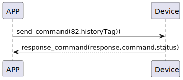

# Lock 鍵を施錠する

### 送信フォーマット
| バイト | 7 ~ 1 | 0 |
|:----:|:----:|:----:|
| データ | historyTag| コマンド |
- コマンド: 指令82（固定）
- historyTag: 履歴タグ

### 受信フォーマット
| バイト | 2 | 1 | 0 |
|:----:|:----:|:----:|:----:|
| データ | ステータス | コマンド | レスポンス  |
- コマンド: 指令82（固定）
- レスポンス: 応答0x07（固定）
- ステータス: 状態0x00（成功）
### シーケンス図


### Androidの例
``` java
     override fun lock(historytag: ByteArray?, result: CHResult<CHEmpty>) {
        if (deviceStatus.value == CHDeviceLoginStatus.UnLogin && isConnectedByWM2) {
            CHAccountManager.cmdSesame(SesameItemCode.lock, this, sesame2KeyData!!.hisTagC(historytag), result)
        } else {
            if (checkBle(result)) return
//        L.d("hcia", "[ss5][lock] historyTag:" + sesame2KeyData!!.createHistagV2(historyTag).toHexString())
            sendCommand(SesameOS3Payload(SesameItemCode.lock.value, sesame2KeyData!!.createHistagV2(historytag)), DeviceSegmentType.cipher) { res ->
                if (res.cmdResultCode == SesameResultCode.success.value) {
                    result.invoke(Result.success(CHResultState.CHResultStateBLE(CHEmpty())))
                } else {
                    result.invoke(Result.failure(NSError(res.cmdResultCode.toString(), "CBCentralManager", res.cmdResultCode.toInt())))
                }
            }
        }

    }
