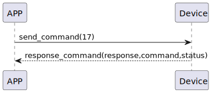

# Magnet 角度補正

### 送信フォーマット
| バイト | 0 |
|:----:|:----:|
| データ |   コマンド |
- コマンド: 指令17（固定）

### 受信フォーマット
| バイト | 2 | 1 | 0 |
|:----:|:----:|:----:|:----:|
| データ | ステータス | コマンド | レスポンス  |
- コマンド: 指令17（固定）
- レスポンス: 応答0x07（固定）
- ステータス: 状態0x00（成功）
### シーケンス図


### Androidの例
``` java
       override fun magnet(result: CHResult<CHEmpty>) {
        if (checkBle(result)) return
        sendCommand(SesameOS3Payload(SesameItemCode.magnet.value, byteArrayOf()), DeviceSegmentType.cipher) { res ->
            result.invoke(Result.success(CHResultState.CHResultStateBLE(CHEmpty())))
        }
    }
