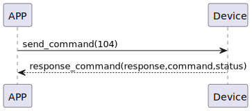

# リセット デバイスのリセット

### 送信フォーマット

|  バイト  |      0       |
|:------:|:------------:|
| データ   |   command    |


- command: 指令104（固定）

### 受信フォーマット

|  バイト   | 2 | 1 | 0 |    
|:-------:|:------:|:---------:|:----------:|  
|  データ   | status | command | response  |  
- command: 指令104（固定）
- response: 响应0x07（固定）
- status: 状態0x00（成功）

### シーケンス図


### Androidの例
```java
open fun reset(result: CHResult<CHEmpty>) {
    sendCommand(SesameOS3Payload(SesameItemCode.Reset.value, byteArrayOf()), DeviceSegmentType.cipher) { res ->
        if (res.cmdResultCode == SesameResultCode.success.value) {
            dropKey(result)
        } else {
            result.invoke(Result.failure(NSError(res.cmdResultCode.toString(), "CBCentralManager", res.cmdResultCode.toInt())))
        }
    }
}
