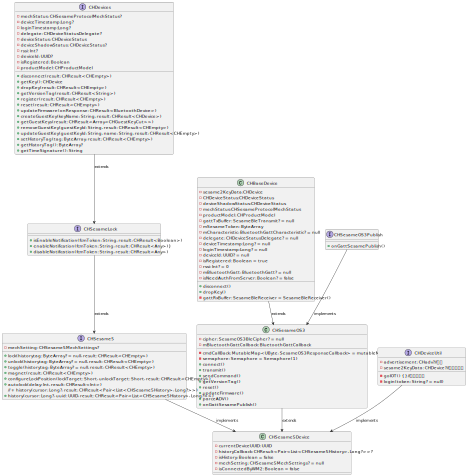

# Sesame5 機能命令
## 実装クラス CHSesame5Device 
### インターフェース
<!-- 
这是单行注释
- # var mechSetting: CHSesame5MechSettings?
-->
```agsl
fun lock(historytag: ByteArray? = null, result: CHResult<CHEmpty>)
fun unlock(historytag: ByteArray? = null, result: CHResult<CHEmpty>)
fun toggle(historytag: ByteArray? = null, result: CHResult<CHEmpty>)
fun magnet(result: CHResult<CHEmpty>)
fun configureLockPosition(lockTarget: Short, unlockTarget: Short, result: CHResult<CHEmpty>)
fun autolock(delay: Int, result: CHResult<Int>)
fun history(cursor: Long?, uuid: UUID, result: CHResult<Pair<List<CHSesame5History>, Long?>>)
fun reset(result: CHResult<CHEmpty>)
fun getVersionTag(result: CHResult<CHEmpty>)
```
### インターフェースの機能の定義
#### 1. [lock](lock.md):ロックする 
#### 2. [unlock](unlock.md):ロックを解除する 
#### 3. toggle:解錠・施錠を切り替える
#### 4. [magnet](magnet.md):角度補正 
#### 5. [configureLockPosition](configureLockPosition.md):ロックのスイッチ状態とロックの位置を取得する 
#### 6. [ autolock ](autolock.md):オートロック
- delay:遅延時間
#### 7. [history](history.md):履歴
#### 8. [reset](reset.md):リセット
#### 9. [getVersionTag](ssm5version.md):バージョンのタグを取得する

### フローチャート



