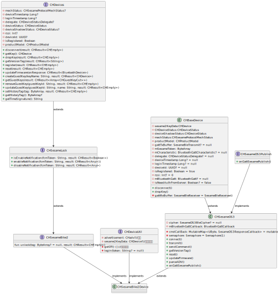

# Bike2 説明
## 実装クラス CHSesameBike2Device
### インターフェース

```agsl
fun unlock(tag: ByteArray? = null, result: CHResult<CHEmpty>)
fun reset(result: CHResult<CHEmpty>)
fun getVersionTag(result: CHResult<CHEmpty>)

```
### インターフェースの機能の定義
- [unlock](unlock.md):ロックを解除する 
- [reset](reset.md):デバイスをリセットする
- [getVersionTag](ssm5version.md):バージョンのタグを取得する
### フローチャート



