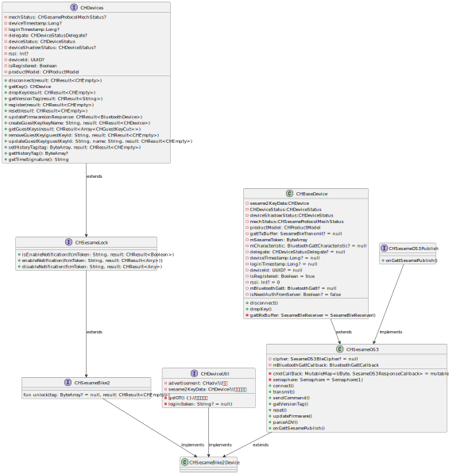

#  Bike2 解説

## 実装クラス: CHSesameBike2Device

### インターフェース

```agsl
fun unlock(tag: ByteArray? = null, result: CHResult<CHEmpty>)
fun reset(result: CHResult<CHEmpty>)
fun getVersionTag(result: CHResult<CHEmpty>)

```
### インターフェースの機能説明

- [unlock](unlock_jp.md):ロックを解除する 
- [reset](reset_jp.md):デバイスをリセットする
- [getVersionTag](ssm5version_jp.md):バージョンタグを取得する
### フローチャート




