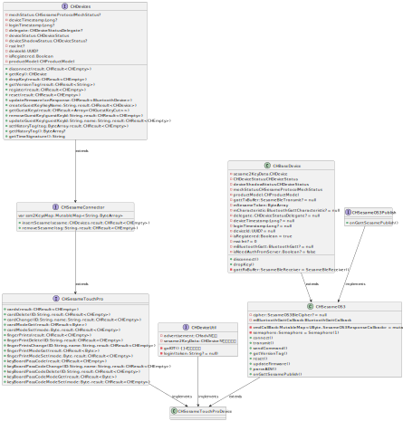

#   CHSesameTouchProDevice  の説明
## 実装クラス CHSesameTouchProDevice

### インターフェース

```agsl
    fun cards(result: CHResult<CHEmpty>)
    fun cardDelete(ID: String, result: CHResult<CHEmpty>)
    fun cardChange(ID: String, name: String, result: CHResult<CHEmpty>)
    fun cardModeGet(result: CHResult<Byte>)
    fun cardModeSet(mode: Byte, result: CHResult<CHEmpty>)

    fun fingerPrints(result: CHResult<CHEmpty>)
    fun fingerPrintDelete(ID: String, result: CHResult<CHEmpty>)
    fun fingerPrintsChange(ID: String, name: String, result: CHResult<CHEmpty>)
    fun fingerPrintModeGet(result: CHResult<Byte>)
    fun fingerPrintModeSet(mode: Byte, result: CHResult<CHEmpty>)

    fun keyBoardPassCode(result: CHResult<CHEmpty>)
    fun keyBoardPassCodeChange(ID: String, name: String, result: CHResult<CHEmpty>)
    fun keyBoardPassCodeDelete(ID: String, result: CHResult<CHEmpty>)
    fun keyBoardPassCodeModeGet(result: CHResult<Byte>)
    fun keyBoardPassCodeModeSet(mode: Byte, result: CHResult<CHEmpty>)
    
    
    fun insertSesame(sesame: CHDevices, result: CHResult<CHEmpty>)
    fun removeSesame(tag: String, result: CHResult<CHEmpty>)
```
### インターフェース機能定義


####  [cards](../touch/card_get_jp.md):カード情報を取得します
####  [cardDelete](../touch/card_delete_jp.md):カードを削除します
####  [cardModeGet](../touch/card_model_get_jp.md):現在のカードモードを取得します
####  [cardModeSet](../touch/card_model_set_jp.md):カードの現在のモードを設定します
####  [cardChange](../touch/card_change_jp.md):カード情報を変更します


####  [fingerPrints](../touch/finger_get_jp.md):指紋情報を取得します
####  [fingerPrintModeGet](../touch/finger_mode_get_jp.md):現在の指紋情報を取得します
####  [fingerPrintModeSet](../touch/finger_mode_set_jp.md):指紋情報を設定します
####  [fingerPrintDelete](../touch/finger_delete_jp.md):指紋を削除します
####  [fingerPrintsChange](../touch/finger_change_jp.md):指紋情報を変更します


####  [keyBoardPassCode](../touch/kbpc_get_jp.md):キーボードのパスコードを取得します
####  [keyBoardPassCodeChange](../touch/kbpc_change_jp.md):キーボードのパスコードを変更します
####  [keyBoardPassCodeDelete](../touch/kbpc_delete_jp.md):キーボードのパスコードを削除します
####  [keyBoardPassCodeModeGet](../touch/kbpc_mode_get_jp.md):キーボードのパスコードモードを取得します
####  [keyBoardPassCodeModeSet](../touch/kbpc_mode_set_jp.md):キーボードのパスコードモードを設定します


####  [insertSesame](../touch/add_sesame_jp.md):Sesameを追加します
####  [removeSesame](../touch/remove_sesame_jp.md):Sesameを削除します

### ループ図




