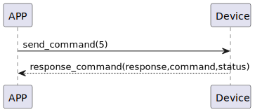

# getVersionTag 获取版本信息

### 发送格式

|  Byte  |    0    |  
|:------:|:-------:|
| Data   | command |

- command:指令5(固定)


### 接收格式

| Byte |    15~3    |   2    | 1 |     0      |  
|:---:|:----------:|:------:|:---:|:---------:|
| Data | versiontag | status | command |response   |
- command:指令5(固定)
- response:响应0x07(固定)
- status:状态0x00(成功)

- versiontag:响应版本号字节
### 循序图



### android示例
``` java
       override fun history(cursor: Long?, uuid: UUID, result: CHResult<Pair<List<CHSesame5History>, Long?>>) {
        currentDeviceUUID = uuid
        historyCallback = result

        CHAccountManager.getHistory(this, cursor) {
            it.onSuccess {
                val chHistorysToUI = ArrayList<CHSesame5History>()
//                L.d("hcia", "it.data:" + it.data)
                it.data.histories.forEach {
                    val historyType = Sesame2HistoryTypeEnum.getByValue(it.type)
                    val ts = it.timeStamp
                    val recordID = it.recordID
                    val histag = it.historyTag?.base64decodeByteArray()
                    val params = it.parameter?.base64decodeByteArray()
                    var mechStatus: CHSesame5MechStatus? = null
                    if (params != null) {
                        mechStatus = CHSesame5MechStatus(params)
                    }

                    val tmphis = eventToHistory(historyType, ts, recordID, mechStatus, histag)
                    if (tmphis != null) {
                        chHistorysToUI.add(tmphis)
                    }
                }
                result.invoke(Result.success(CHResultState.CHResultStateNetworks(Pair(chHistorysToUI.toList(), it.data.cursor))))
            }
            it.onFailure {
                L.d("hcia", "it:" + it)
                result.invoke(Result.failure(it))
            }
        } //end getHistory
    }
```
