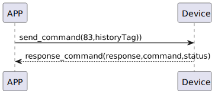

# unLock 開錠

### 送信形式
| バイト | 7 ~ 1 | 0 |
|:----:|:----:|:----:|
| データ | historyTag|  command |
- command: 指令83 (固定)
- historyTag: 履歴タグ

## 受信形式
| バイト | 2 | 1 | 0 |  
|:----:|:----:|:----:|:----:|
| データ | status | command | response  |  
- response: 応答0x07 (固定)
- command: 指令83 (固定)
- status: 状態0x00 (成功)

## シーケンス図


## Androidの例

```java
@Override
public void unlock(byte[] historytag, CHResult<CHEmpty> result) {
    if (deviceStatus.getValue() == CHDeviceLoginStatus.UnLogin && isConnectedByWM2) {
        CHAccountManager.cmdSesame(SesameItemCode.unlock, this, sesame2KeyData!!.hisTagC(historytag), result);
    } else {
        if (checkBle(result)) return;
        sendCommand(new SesameOS3Payload(SesameItemCode.unlock.getValue(), sesame2KeyData!!.createHistagV2(historytag)), DeviceSegmentType.cipher, res -> {
            if (res.getCmdResultCode() == SesameResultCode.success.getValue()) {
                result.invoke(Result.success(new CHResultState.CHResultStateBLE(new CHEmpty())));
            } else {
                result.invoke(Result.failure(new NSError(res.getCmdResultCode().toString(), "CBCentralManager", res.getCmdResultCode())));
            }
        });
    }
}
