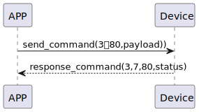

# updataSetting 更新设置

### 发送格式
| Byte |  N ~ 2  |    1    |0|
|:----:|:-------:|:-------:|:---:|
| Data | payload | command |opcode|
- command:指令80(固定)
- payload:传输data
- opcode:值为3。详情参考[opcode](../class/SSM2OpCode.md)
## 接收格式
| Byte | 3|    2    | 1 |   0   |  
|:----:|:----:|:-------:|:----:|:-----:|
| Data | status | command | response  |opcode |
- response:响应0x07(固定)
- command:指令80(固定)
- status:状态0x00(成功)
- opcode:值为3。详情参考[opcode](../class/SSM2OpCode.md)
## 循序图



## android示例
``` java
     override fun updateSetting(setting: CHSesameBotMechSettings, historyTag: ByteArray?, result: CHResult<CHEmpty>) {
        if (checkBle(result)) return

        val his = sesame2KeyData!!.createHistag(historyTag)
        sendEncryptCommand(SSM2Payload(SSM2OpCode.update, SesameItemCode.mechSetting, setting.data() + his)) { res ->
            if (res.cmdResultCode == SesameResultCode.success.value) {
                mechSetting = setting
                result.invoke(Result.success(CHResultState.CHResultStateBLE(CHEmpty())))
            } else {
                result.invoke(Result.failure(NSError(res.cmdResultCode.toString(), "CBCentralManager", res.cmdResultCode.toInt())))
            }
        }
    }
```
