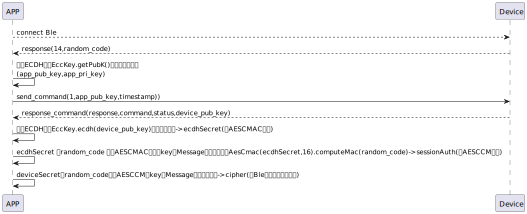

# BLE暗号化アルゴリズム

### ECDH実装クラスEccKey。楕円曲線暗号学に基づく鍵交換プロトコルで、プロジェクトでは楕円曲線方程式：y^2 = x^3 - 3x + b を使用して鍵対を生成し、アプリとBleデバイス間での暗号化キーの交換に使用されます。AesCmacの鍵にも使用されます。

#### コード例
```agsl
アプリは公開鍵をBleデバイスに送信します
sendCommand(SesameOS3Payload(SesameItemCode.registration.value, EccKey.getPubK().hexStringToByteArray() + System.currentTimeMillis().toUInt32ByteArray()), DeviceSegmentType.plain)
共有鍵を生成
val ecdhSecret = EccKey.ecdh(eccPublicKeyFromSS5)

```
### AESCMAC実装クラスAesCmac、Macを継承しています。メッセージの認証コードを計算するために使用され、computeMacメソッドはメッセージ認証コードを生成します。EccKeyの鍵にも使用されます。

#### コード例


```agsl
 AesCmac(secret, 16).computeMac(signPayload)
  
```
### AESCCM実装クラスSesameOS3BleCipher、主にBluetooth通信の転送に適用され、対称鍵暗号化とメッセージ認証コード（MAC）を組み合わせてデータの機密性と完全性の保護を実現します。プロジェクトではAESCCMは主にBLE通信の暗号化および復号のために使用され、sessionAuthはAESCMACから生成されます。

#### コード例


```agsl
作成 
cipher = SesameOS3BleCipher(sessionAuth, ("00" + mSesameToken.toHexString()).hexStringToByteArray())
暗号化 
cipher.encrypt(payload.toDataWithHeader())
復号
cipher.decrypt(ssmSay.second)

```
#### アルゴリズムの適用図




