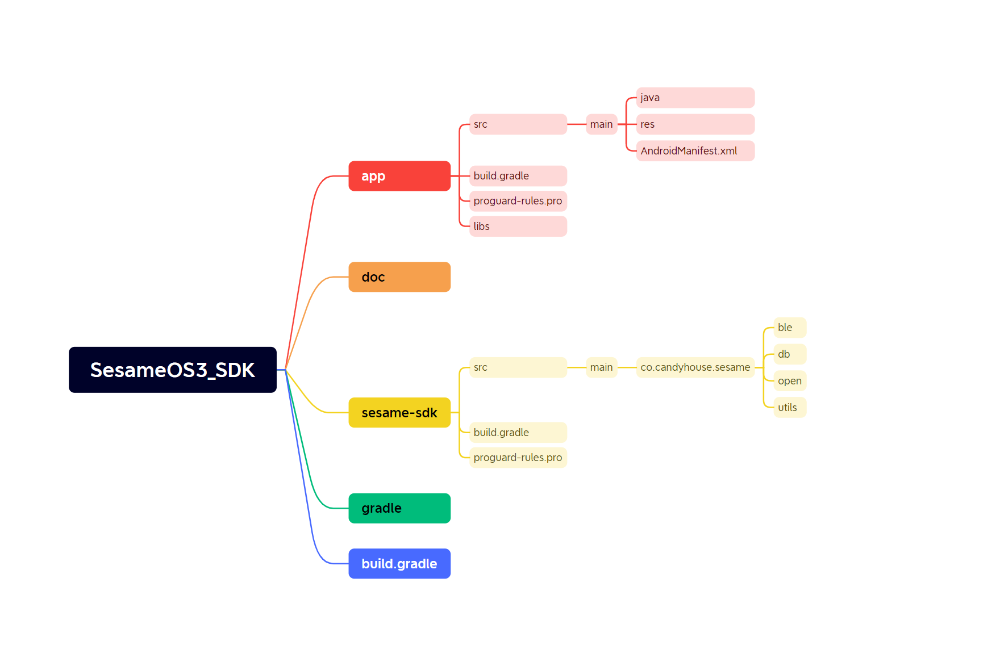

# Android プロジェクトの構造例

以下は一般的な Android プロジェクトの構造の例で、コードとリソースファイルを整理するために使用されます。

この例では、主なプロジェクトの構造は次の通りです：
- `libs/`：通常、サードパーティのライブラリ（.jar、.aar など）のバイナリファイルを格納するためのフォルダです。
- `java/`：Java コードを格納する場所です。機能モジュールごとにサブパッケージに分割されます。例えば `activities/` はアクティビティクラスを、`adapters/` はアダプタークラスを格納する場所です。

- `res/`：リソースファイルを格納する場所で、レイアウトファイル、文字列、アイコンなどが含まれます。リソースの種類ごとにディレクトリを分けて格納します。例えば `layout/` はレイアウトファイルを、`drawable/` は画像リソースを、`values/` は文字列やスタイルのリソースを格納します。

- `build.gradle`：アプリケーションレベルの Gradle 設定ファイルで、依存関係、プラグイン、ビルド設定を構成するために使用されます。

- `proguard-rules.pro`：ProGuard 設定ファイルで、コードの難読化と最適化を行うために使用されます。これはオプションで、リリースバージョンの場合に使用されます。
- co.candyhouse.sesame.ble：主にos2、os3のBleデバイスの接続と機能を格納します。
- co.candyhouse.sesame.db：ローカルストレージを格納します。
- co.candyhouse.sesame.open：Bleデバイスの管理、設定、パラメータを格納します。
- co.candyhouse.sesame.utils：Ble転送の暗号化アルゴリズムやログの記録を格納します。
