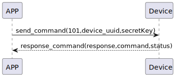

# Insert Sesame  説明

### 送信フォーマット

|  Byte  | 32~17|         16~1 |       0 |
|:------:|:----:|-------------:|--------:|
| Data   |secretKey| device_uuid	 | command |

- command:命令101(固定)
- device_uuid:デバイス唯一の識別子UUID
- secretKey:セキュリティkey
```agsl

 internal fun getDeviceECCKey(): KeyPair {
        keyPairA?.let { return it }
        val keyGen = KeyPairGenerator.getInstance("EC")
        keyGen.initialize(ECGenParameterSpec("secp256r1")) //prime256v1 == secp256r1 == NIST P-256
        val newKeyPairA = keyGen.generateKeyPair()
        keyPairA = newKeyPairA
        return newKeyPairA
    }
```

### 受信フォーマット

| Byte  |    2 |   1   |     0      |
|:---:|:----:|:----:|:-----:|
| Data |  status  | command |response   |
- command:命令101(固定)
- response:応答0x07(固定)
- status:状態0x00(成功)  


### フローチャート



### android例
``` java
 override fun insertSesame(sesame: CHDevices, result: CHResult<CHEmpty>) {
        if (checkBle(result)) return
        if (sesame !is CHSesameLock) {// 不是锁不处理
            L.d("hcia", "[SSM BTN]isLocker?")
            result.invoke(Result.failure(CHError.BleInvalidAction.value))
            return
        }
        L.d("hcia", "送出鑰匙sesame.getKey():" + sesame.getKey())

        if (sesame is CHSesameOS3) {///ss5/5pro,bike2
            val ssm = sesame as CHDeviceUtil
            val noDashUUID = ssm.sesame2KeyData!!.deviceUUID.replace("-", "")
            val noDashUUIDDATA = noDashUUID.hexStringToByteArray()
            val ssmSecKa = ssm.sesame2KeyData!!.secretKey.hexStringToByteArray()
            sendCommand(SesameOS3Payload(SesameItemCode.ADD_SESAME.value, noDashUUIDDATA + ssmSecKa)) { ssm2ResponsePayload ->
//                L.d("hcia", "ADD_SESAME cmdResultCode:" + ssm2ResponsePayload.cmdResultCode)
                result.invoke(Result.success(CHResultState.CHResultStateBLE(CHEmpty())))
            }
        } else {/// ss3/4,bot1,bike1
            val ssm = sesame as CHDeviceUtil
            val noDashUUID = ssm.sesame2KeyData!!.deviceUUID.replace("-", "")
            val b64k = noDashUUID.hexStringToByteArray().base64Encode().replace("=", "")
            val ssmIRData = b64k.toByteArray()
            val ssmPKData = ssm.sesame2KeyData!!.sesame2PublicKey.hexStringToByteArray()
            val ssmSecKa = ssm.sesame2KeyData!!.secretKey.hexStringToByteArray()
            val allKey = ssmIRData + ssmPKData + ssmSecKa
            sendCommand(SesameOS3Payload(SesameItemCode.ADD_SESAME.value, allKey)) {
                result.invoke(Result.success(CHResultState.CHResultStateBLE(CHEmpty())))
            }
        }

    }
```
