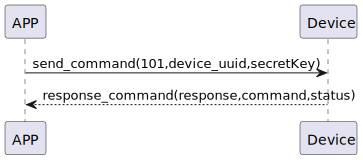

# Insert Sesame の説明
新しいSesameデバイスを追加するために101コマンドを送信します。

### 送信形式

|  バイト  | 32~17|         16~1 |       0 |
|:------:|:----:|-------------:|--------:|
| データ   |secretKey| device_uuid	 | command |

- command: 101コマンド (固定)
- device_uuid: デバイスの一意の識別UUID
- secretKey: セキュリティキー

```kotlin
internal fun getDeviceECCKey(): KeyPair {
    keyPairA?.let { return it }
    val keyGen = KeyPairGenerator.getInstance("EC")
    keyGen.initialize(ECGenParameterSpec("secp256r1")) // prime256v1 == secp256r1 == NIST P-256
    val newKeyPairA = keyGen.generateKeyPair()
    keyPairA = newKeyPairA
    return newKeyPairA
}
```

### 受信形式


| バイト  |    2 |   1   |     0      |
|:---:|:----:|:----:|:-----:|
| データ |  status  | command |response   |
- command:101コマンド(固定)
- response:0x07応答 (固定)
- status:状態 0x00 (成功)  


### シーケンス図




### Androidの例

``` java
 override fun insertSesame(sesame: CHDevices, result: CHResult<CHEmpty>) {
        if (checkBle(result)) return
        if (sesame !is CHSesameLock) {// 不是锁不处理
            L.d("hcia", "[SSM BTN]isLocker?")
            result.invoke(Result.failure(CHError.BleInvalidAction.value))
            return
        }
        L.d("hcia", "送出鑰匙sesame.getKey():" + sesame.getKey())

        if (sesame is CHSesameOS3) {///ss5/5pro,bike2
            val ssm = sesame as CHDeviceUtil
            val noDashUUID = ssm.sesame2KeyData!!.deviceUUID.replace("-", "")
            val noDashUUIDDATA = noDashUUID.hexStringToByteArray()
            val ssmSecKa = ssm.sesame2KeyData!!.secretKey.hexStringToByteArray()
            sendCommand(SesameOS3Payload(SesameItemCode.ADD_SESAME.value, noDashUUIDDATA + ssmSecKa)) { ssm2ResponsePayload ->
//                L.d("hcia", "ADD_SESAME cmdResultCode:" + ssm2ResponsePayload.cmdResultCode)
                result.invoke(Result.success(CHResultState.CHResultStateBLE(CHEmpty())))
            }
        } else {/// ss3/4,bot1,bike1
            val ssm = sesame as CHDeviceUtil
            val noDashUUID = ssm.sesame2KeyData!!.deviceUUID.replace("-", "")
            val b64k = noDashUUID.hexStringToByteArray().base64Encode().replace("=", "")
            val ssmIRData = b64k.toByteArray()
            val ssmPKData = ssm.sesame2KeyData!!.sesame2PublicKey.hexStringToByteArray()
            val ssmSecKa = ssm.sesame2KeyData!!.secretKey.hexStringToByteArray()
            val allKey = ssmIRData + ssmPKData + ssmSecKa
            sendCommand(SesameOS3Payload(SesameItemCode.ADD_SESAME.value, allKey)) {
                result.invoke(Result.success(CHResultState.CHResultStateBLE(CHEmpty())))
            }
        }

    }
```
