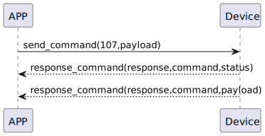

# Card Change 説明
ssm_touch 新しいカードが追加されると、そのカードのIDと名前が自動的に携帯電話に送信されます。アプリはカードの名前を変更して命令107を送信します。
### 送信フォーマット

|  Byte  |      N~1 |       0 |
|:------:|---------:|--------:|
| Data   | payload	 | command |

- command:命令107(固定)
- payload:payload表を参照する 
##### **payload表**  

|  Byte  |     card_name| card_name_length| card_id|     0 |
|:------:|:---------:|:--------:|:--------:|:--------:|
| Data   | card_name	 | card_name_length |card_id|card_id_length|


### 受信フォーマット

| Byte  |    2 |   1   |     0      |
|:---:|:----:|:----:|:-----:|
| Data |  status  | command |response   |
- command:命令107(固定)
- response:応答0x07(固定)
- status:状態0x00(成功)
### プッシュ情報
|  Byte  |   N~2    |    1    |    0     |
|:------:|:--------:|:--------:|:--------:|
| Data   | payload	 | command |response  |
- command:命令107(固定)
- response:応答0x08(固定)
- payload:payload表を参照する
##### **payload表**

|  Byte  |     card_name| card_name_length| card_id|     0 |
|:------:|:---------:|:--------:|:--------:|:--------:|
| Data   | card_name	 | card_name_length |card_id|card_id_length|

### フローチャート



### android例
``` java
  override fun cardChange(ID: String, name: String, result: CHResult<CHEmpty>) {
        if (checkBle(result)) return
        sendCommand(SesameOS3Payload(SesameItemCode.SSM_OS3_CARD_CHANGE.value, byteArrayOf(ID.hexStringToByteArray().size.toByte()) + ID.hexStringToByteArray() + name.toByteArray())) { res ->
            result.invoke(Result.success(CHResultState.CHResultStateBLE(CHEmpty())))
        }
    }
```
