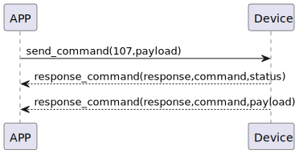

# Card Change の説明
SSM Touchは新しいカードを追加すると、新しいカードのIDと名前を自動的にスマートフォンにプッシュします。アプリはカードの名前を変更するために107コマンドを送信します。

### 送信形式

|  バイト  |      N~1 |       0 |
|:------:|---------:|--------:|
| データ   | payload	 | command |

- command: 107コマンド (固定)
- payload: ペイロードを参照してください。

##### **payloadは次のとおりです**

|  バイト  |     card_name| card_name_length| card_id|     0 |
|:------:|:---------:|:--------:|:--------:|:--------:|
| データ   | card_name	 | card_name_length |card_id|card_id_length|

### 受信形式

| バイト  |    2 |   1   |     0      |
|:---:|:----:|:----:|:-----:|
| データ |  status  | command |response   |
- command: 107コマンド (固定)
- response: 0x07応答 (固定)
- status: 状態 0x00 (成功)

### プッシュ情報

|  バイト  |   N~2    |    1    |    0     |
|:------:|:--------:|:--------:|:--------:|
| データ   | payload	 | command |response  |
- command: 107コマンド (固定)
- response: 0x08応答 (固定)
- payload: ペイロードを参照してください。

##### **payloadは次のとおりです**

|  バイト  |     card_name| card_name_length| card_id|     0 |
|:------:|:---------:|:--------:|:--------:|:--------:|
| データ   | card_name	 | card_name_length |card_id|card_id_length|

### シーケンス図


### Androidの例

``` java
  override fun cardChange(ID: String, name: String, result: CHResult<CHEmpty>) {
        if (checkBle(result)) return
        sendCommand(SesameOS3Payload(SesameItemCode.SSM_OS3_CARD_CHANGE.value, byteArrayOf(ID.hexStringToByteArray().size.toByte()) + ID.hexStringToByteArray() + name.toByteArray())) { res ->
            result.invoke(Result.success(CHResultState.CHResultStateBLE(CHEmpty())))
        }
    }
