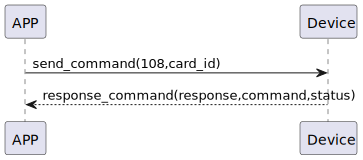

# Card Delete 説明

### 送信フォーマット

|  Byte  |     16~1 |       0 |
|:------:|---------:|--------:|
| Data   | card_id	 | command |

- command:命令108(固定)
- card_id:カードID


### 受信フォーマット

| Byte  |    2 |   1   |     0      |
|:---:|:----:|:----:|:-----:|
| Data |  status  | command |response   |
- command:命令108(固定)
- response:応答0x07(固定)
- status:状態0x00(成功)  


### フローチャート



### android例
``` java
    override fun cardDelete(ID: String, result: CHResult<CHEmpty>) {
        if (checkBle(result)) return
        sendCommand(SesameOS3Payload(SesameItemCode.SSM_OS3_CARD_DELETE.value, ID.hexStringToByteArray())) { res ->
            result.invoke(Result.success(CHResultState.CHResultStateBLE(CHEmpty())))
        }
    }
```
