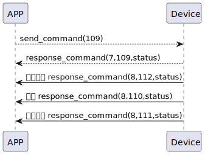

# Card Get の説明
スマートフォンは109コマンドを送信して、現在のカード情報を取得します。

### 送信形式


|  Byte  |     16~1 |       0 |
|:------:|---------:|--------:|
| Data   | card_id	 | command |

- command:109コマンド (固定)
- card_id:カードID


### 接收格式

| Byte  |    2 |   1   |     0      |
|:---:|:----:|:----:|:-----:|
| Data |  status  | command |response   |
- command:109コマンド (固定)
- response:0x07応答 (固定)
- status:状態0x00(成功)  
### 推送格式-start
| Byte  |       2 |   1   |  0   |
|:---:|:-------:|:-----:|:----:|
| Data |  status | command | push |
- command:112コマンド(固定)
- response:0x08応答 (固定)
- push:0x00(成功)
### 推送格式
| Byte  | N~   2 |   1   |  0   |
|:---:|:------:|:-----:|:----:|
| Data | payload | command | push |
- command:110コマンド (固定)
- push:0x08応答 (固定)
- payload: ペイロードを参照してください.

##### **payloadは次のとおりです**

|  Byte  |     card_name| card_name_length| card_id|     0 |
|:------:|:---------:|:--------:|:--------:|:--------:|
| Data   | card_name     | card_name_length |card_id|card_id_length|
### プッシュ形式-終了
| Byte  |       2 |   1   |     0      |
|:---:|:-------:|:-----:|:----:|
| Data |  status | command |push   |
- command:111コマンド (固定)
- response:0x08応答 (固定)
- push:0x00(成功)

### シーケンス図




### Androidの例


``` java
 override fun cards(result: CHResult<CHEmpty>) {
        if (checkBle(result)) return
        sendCommand(SesameOS3Payload(SesameItemCode.SSM_OS3_CARD_GET.value, byteArrayOf())) { res ->
            result.invoke(Result.success(CHResultState.CHResultStateBLE(CHEmpty())))
        }
    }
```
