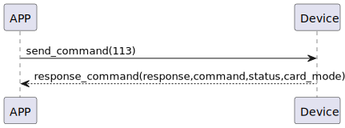

# Card Mode Get  の説明
スマートフォンは113コマンドを送信して、現在のカードの追加または認証モードを取得します。

### 送信形式


|  Byte  |       0 |
|:------:|-------:|
| Data   |  command |

- command:113コマンド (固定)


### 受信形式


| Byte  |     3    |   2 |   1   |     0      |
|:---:|:-------:|:-----:|:----:|:-----:|
| Data | card_mode|  status | command |response   |
- command:113コマンド (固定)
- response:0x07応答 (固定)
- status:0x00(成功)
- card_mode:0x00->認証モード，0x01->追加モード


### シーケンス図




### Androidの例

``` java
 override fun cards(result: CHResult<CHEmpty>) {
        if (checkBle(result)) return
        sendCommand(SesameOS3Payload(SesameItemCode.SSM_OS3_CARD_GET.value, byteArrayOf())) { res ->
            result.invoke(Result.success(CHResultState.CHResultStateBLE(CHEmpty())))
        }
    }
```
