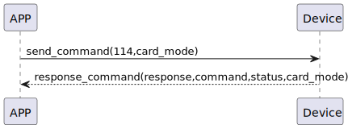

# Card Mode Set 説明
携帯電話で命令114を送信し、新規モードまたは認証モードに設置します。
### 送信フォーマット

|  Byte  |  1|    0    |
|:------:|----:|:-------:|
| Data   | card_mode| command |

- command:命令114(固定)

- card_mode:0x00->認証モード，0x01->新規モード


### 受信フォーマット

| Byte  |   3|    2    |   1   |     0      |
|:---:|:----:|:-------:|:-----:|:----:|
| Data | card_mode|  status | command |response   |
- command:命令114(固定)
- response:応答0x07(固定)
- status:0x00(成功)  
- card_mode:0x00->認証モード，0x01->新規モード

### フローチャート



### android例
``` java
  override fun cardModeSet(mode: Byte, result: CHResult<CHEmpty>) {
        if (checkBle(result)) return
        sendCommand(SesameOS3Payload(SesameItemCode.SSM_OS3_CARD_MODE_SET.value, byteArrayOf(mode))) { res ->
            result.invoke(Result.success(CHResultState.CHResultStateBLE(CHEmpty())))
        }
    }
```
