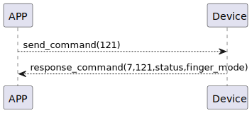

# Finger Mode Get 説明
app は命令121を送信し、ssm_touchの指紋状態を取得します。
### 送信フォーマット

|  Byte  |       0 |
|:------:|-------:|
| Data   |  command |

- command:命令121(固定)


### 受信フォーマット

| Byte  |          3    | 2   |     1     |     0      |
|:---:|:-----------:|:------:|:----:|:---------:|
| Data | finger_mode | status | command |response   |
- command:命令121(固定)
- response:応答0x07(固定)
  - status:0x00(成功) 
  - finger_mode:0x00->認証モード，0x01->新規モード 


### フローチャート



### android例
``` java
  override fun fingerPrintModeGet(result: CHResult<Byte>) {
        if (checkBle(result)) return
        sendCommand(SesameOS3Payload(SesameItemCode.SSM_OS3_FINGERPRINT_MODE_GET.value, byteArrayOf())) { res ->
            result.invoke(Result.success(CHResultState.CHResultStateBLE(res.payload[0])))
        }
    }
```
