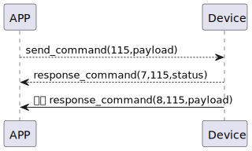

# Finger Change 説明
1. ssm_touchに新しい指紋を追加すると、指紋情報が自動的にアプリに送信されます。
2. APPで新しい名前を変更し、命令123をssm_touchに送信します。

### 送信フォーマット

|  Byte  |       N~1 |    0     |
|:------:|----------:|:--------:|
| Data   | payload |  command |

- command:命令123(固定)
- payload:payload表を参照する

### 受信フォーマット
| Byte  |        2   |     1     |     0      |
|:---:|:-----------:|:----:|:---------:|
| Data |  status | command |response   |
- command:命令123(固定)
- response:応答0x07(固定)
    - status:0x00(成功)
### プッシュフォーマット

| Byte  |          2 |     1     |  0   |
|:---:|:---:|----------:|:----:|
| Data | payload|   command | push |
- command:命令123(固定)
- push:応答0x08(固定)
- payload:payload表を参照する

##### **payload表**

|  Byte  |     pw_name| pw_name_length| pw_id|     0 |
|:------:|:---------:|:--------:|:--------:|:--------:|
| Data   | pw_name	 | pw_name_length |pw_id|pw_id_length|

### フローチャート



### android示例
``` java
   override fun keyBoardPassCodeChange(ID: String, name: String, result: CHResult<CHEmpty>) {
        if (checkBle(result)) return
        sendCommand(SesameOS3Payload(SesameItemCode.SSM_OS3_PASSCODE_CHANGE.value, byteArrayOf(ID.hexStringToByteArray().size.toByte()) + ID.hexStringToByteArray() + name.toByteArray())) { res ->
            result.invoke(Result.success(CHResultState.CHResultStateBLE(CHEmpty())))
        }
    }
```
