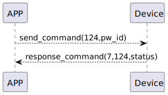

# KeyboardPassword Delete 讲解
app 发送发送124指令，删除密码
### 发送格式

|  Byte  |     1 |    0     |
|:------:|------:|:--------:|
| Data   | pw_id |  command |

- command:指令124(固定)
- pc_id:指纹ID


### 接收格式

| Byte  |        2   |     1     |     0      |
|:---:|:-----------:|:----:|:---------:|
| Data |  status | command |response   |
- command:指令124(固定)
- response:响应0x07(固定)
    - status:0x00(成功)


### 循序图



### android示例
``` java
   override fun keyBoardPassCodeDelete(ID: String, result: CHResult<CHEmpty>) {
        if (checkBle(result)) return
        sendCommand(SesameOS3Payload(SesameItemCode.SSM_OS3_PASSCODE_DELETE.value, ID.hexStringToByteArray())) { res ->
            result.invoke(Result.success(CHResultState.CHResultStateBLE(CHEmpty())))
        }
    }
```
