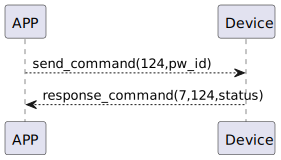

# KeyboardPassword Delete 説明
アプリが124コマンドを送信して、指定したIDのパスワードを削除します。

### 送信フォーマット

|  バイト  |     1 |    0     |
|:------:|------:|:--------:|
| データ   | パスワードID |  コマンド |

- コマンド: 指令124（固定）
- パスワードID: 削除するパスワードのID

### 受信フォーマット
| バイト  |        2   |     1     |     0      |
|:---:|:-----------:|:----:|:---------:|
| データ |  ステータス | コマンド |レスポンス   |
- コマンド: 指令124（固定）
- レスポンス: 応答0x07（固定）
  - ステータス: 0x00（成功）

### シーケンス図


### Androidの例
```java
   override fun keyBoardPassCodeDelete(ID: String, result: CHResult<CHEmpty>) {
        if (checkBle(result)) return
        sendCommand(SesameOS3Payload(SesameItemCode.SSM_OS3_PASSCODE_DELETE.value, ID.hexStringToByteArray())) { res ->
            result.invoke(Result.success(CHResultState.CHResultStateBLE(CHEmpty())))
        }
    }
