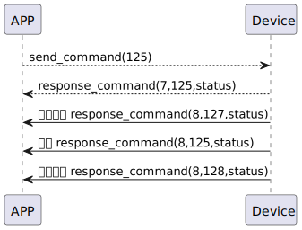

# KeyboardPassword  Get 説明
携帯電話で命令125を送信し、手机发送125指令，获取ssm_touchのパスワードを取得します。
### 送信フォーマット

|  Byte  |       0 |
|:------:|-------:|
| Data   |  command |

- command:命令125(固定)

### 受信フォーマット

| Byte  |       2 |   1   |     0      |
|:---:|:-------:|:-----:|:----:|
| Data |  status | command |response   |
- command:命令125(固定)
- response:応答0x07(固定)
- status:0x00(成功)
### プッシュフォーマット-start
| Byte  |       2 |   1   |  0   |
|:---:|:-------:|:-----:|:----:|
| Data |  status | command | push |
- command:命令127(固定)
- response:応答0x08(固定)
- push:0x00(成功)
### プッシュフォーマット
| Byte  | N~   2 |   1   |  0   |
|:---:|:------:|:-----:|:----:|
| Data | payload | command | push |
- command:命令125(固定)
- push:応答0x08(固定)
- payload:playload表を参照する.

##### **payload表**

|  Byte  |     pw_name| pw_name_length| pw_id|     0 |
|:------:|:---------:|:--------:|:--------:|:--------:|
| Data   | pw_name     | pw_name_length |pw_id|pw_id_length|
### プッシュフォーマット-end
| Byte  |       2 |   1   |     0      |
|:---:|:-------:|:-----:|:----:|
| Data |  status | command |push   |
- command:命令128(固定)
- response:応答0x08(固定)
- push:0x00(成功)
### フローチャート



### android例
``` java
  override fun keyBoardPassCode(result: CHResult<CHEmpty>) {
        if (checkBle(result)) return
        sendCommand(SesameOS3Payload(SesameItemCode.SSM_OS3_PASSCODE_GET.value, byteArrayOf())) { res ->
            result.invoke(Result.success(CHResultState.CHResultStateBLE(CHEmpty())))
        }
    }
```
